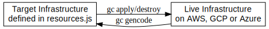
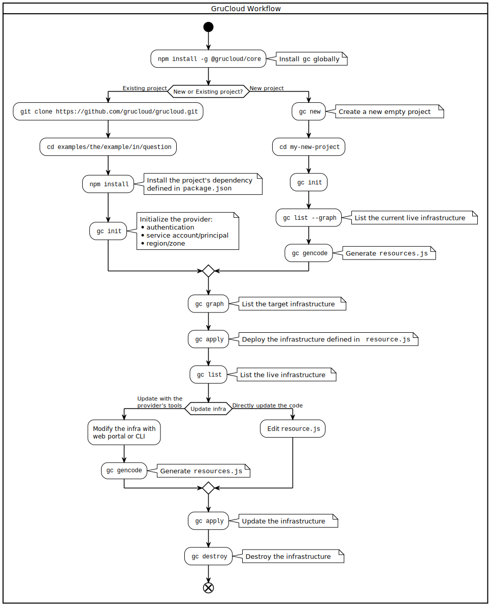

# What is GruCloud ?

GruCloud is a tool for Cloud Solution Architect and DevOps people which allows them to describe and manage cloud infrastructures as Javascript code.

Do you need to create virtual machines, object storage for websites, maintain DNS records, handle SSL certificates, or manage Kubernetes clusters? GruCloud lets you describe and configure these resources with simple Javascript code. The GruCloud CLI interprets this description, connects to the various cloud provider API, and decides what to create, update and destroy.

A key feature is the ability to generate automatically the target code from the live infrastructure.

The next flowchart describes how to use the GruCloud CLI `gc` to manage your infrastructure:

# Getting Started

- [AWS](./aws/AwsGettingStarted.md)
- [Google Cloud](./google/GoogleGettingStarted.md)
- [Microsoft Azure](./azure/AzureGettingStarted.md)
- [Kubernetes](./k8s/K8sGettingStarted.md)
