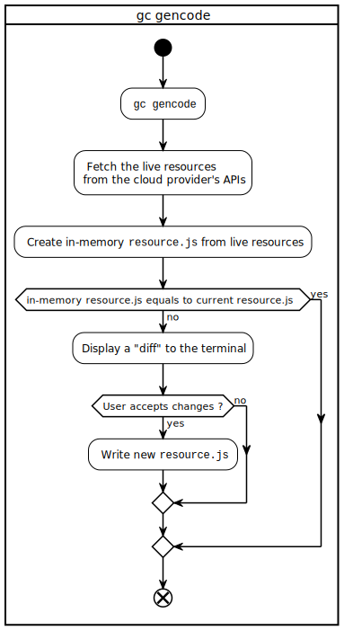

This document describes how to get started with GruCloud on AWS.

import TOCInline from '@theme/TOCInline';

<TOCInline toc={toc} />

## Use Cases

The following use case diagram depicts an overview of what a Solution Architect/DevOps can perform with GruCloud.


## Workflow

While the previous use case diagram shows a high-level description, the next flowchart diagram details the commands to perform to migrate an existing infrastructure to GruCloud, regardless of how the infrastructure was deployed: via the web interface, or via an IaC tool such as _Terraform_, _pulumi_ or the _AWS CDK_.


## Requirements

- AWS Account
- AWS CLI
- Access and Secret Key

### AWS Account

Ensure access to the [Amazon Console](https://console.aws.amazon.com) and create an account if necessary.

### AWS CLI

Ensure the _AWS CLI_ is installed and configured:

```sh
aws --version
```

If not, visit https://docs.aws.amazon.com/cli/latest/userguide/install-cliv2.html

### Access and Secret Key

Visit the [security credentials](https://console.aws.amazon.com/iam/home#/security_credentials)

- Click on **Access key (access key ID and secret access key).**
- Click on the button **Create New Access Key**.

Write down the **AWSAccessKeyId** and **AWSSecretKey**

> In a further episode, the access and secret key will be obtained from a dedicated IAM user with the correct role and policy.

### Getting the GruCloud CLI

This chart describes the way to install **gc**, the GruCloud CLI:


GruCloud is written in Javascript running on [Node.js](https://nodejs.org/). Check if `node` is present on your system

```
node --version
```

> The version must be greater than 14

Install the _GrucCloud_ command-line utility **gc** with _npm_

```sh
npm i -g @grucloud/core
```

Check the current version of **gc**:

```sh
gc --version
```

## GruCloud CLI

### `gc new` Create a new project

The [new](../cli/New.md) command guides you on how to create and configure a new project.


Below is the screencast of **gc new**:

 <div>
    <iframe
    data-autoplay
    src="https://asciinema.org/a/daLrxnF4qNuuUksSugIBjmi2F/iframe?autoplay=true&amp;speed=2&amp;loop=true"
    id="asciicast-iframe-13761"
    name="asciicast-iframe-13761"
    scrolling="no"
    style={{ width: "100%", height: "400px" }}
    ></iframe>
</div>
            
The boilerplate project is now created and configured.

### `gc list` List the live resources

Visualize your current infrastructure with the [list](../cli/List.md) command:

```sh
gc list --graph
```

The following diagram is taken from the [ec2-vpc example](https://github.com/grucloud/grucloud/tree/main/examples/aws/EC2/Instance/ec2-vpc)


### `gc gencode` Generate the code

The [gencode](../cli/GenCode.md) command fetches the live resources and generate the code in `resource.js`

```sh
gc gencode
```

The following flowchart explains in more detail the process of generating the code from the live infrastructure.



At this point, the target infrastructure matches the live infrastructure.

### `gc graph` Target Graph

The [graph](../cli/Graph.md) command creates a dependency graph of the target resources:

```sh
gc graph
```


> The `graph` command requires [graphviz](https://graphviz.org/) to convert the generated `artifacts/diagram-target.dot` into an image such as `artifacts/diagram-target.svg`

### `gc tree` Resource mind map

Given the target resources defined in _resources.js_, let's generate a mindmap of the target resources by group and type with the [tree](../cli/Tree.md) command.

```sh
gc tree
```


### `gc apply` Update

To update the infrastructure, either use the AWS console and run **gc gencode**, or modify directly the file **resource.js**.
Once done, use the [apply](../cli/Apply.md) command to update the infrastructure:

```sh
gc apply
```

For instance, let's change the EC2 _InstanceType_ from _t2.micro_ to _t2.small_. The machine will be stopped, its _InstanceType_ changed, and finally, the machine will be started.

<div>
    <iframe
    data-autoplay
    src="https://asciinema.org/a/iab00IPqf2GCNx4nHRJQ0snKN/iframe?autoplay=true&amp;speed=2&amp;loop=true"
    id="asciicast-iframe-13761"
    name="asciicast-iframe-13761"
    scrolling="no"
    style={{ width: "100%", height: "700px" }}
    ></iframe>
</div>

### `gc destroy` Destroy

Resources can be destroyed in the right order with the [destroy](../cli/Destroy.md) command:

```sh
gc destroy
```

<div>
    <iframe
    data-autoplay
    src="https://asciinema.org/a/0lD2ub5ltJCEifqifCWGNYAg6/iframe?autoplay=true&amp;speed=2&amp;loop=true"
    id="asciicast-iframe-13761"
    name="asciicast-iframe-13761"
    scrolling="no"
    style={{ width: "100%", height: "700px" }}
    ></iframe>
</div>

## Next Steps

- More information about the [configuration](./AwsConfig.md) of this AWS provider.

- Browse the various [examples](https://github.com/grucloud/grucloud/tree/main/examples/aws) which helps to find out how to use this software.

- 800+ Available [Aws Resources](./AwsResources.md)
