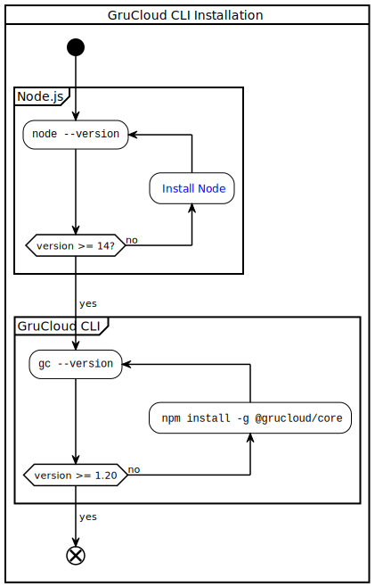
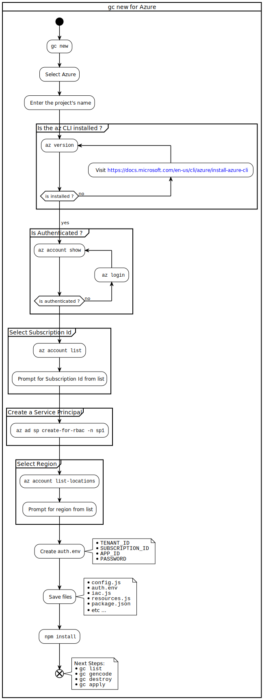

This document describes how to get started with GruCloud on Azure.

import TOCInline from '@theme/TOCInline';

<TOCInline toc={toc} />

## Use Cases


## Workflow


## Requirement

### Azure Account

Visit the [azure portal](https://portal.azure.com) and ensure you have an azure account as well as a subscription.

### Azure CLI

Install the Azure Command-Line Interface **az** from [here](https://docs.microsoft.com/en-us/cli/azure/install-azure-cli?view=azure-cli-latest)

At this point, ensure the **az** command is installed:

```bash
az --version
```

### Installing the GruCloud CLI

The GruCloud CLI, `gc`, is written in Javascript running on [Node.js](https://nodejs.org)

Install it globally with:

```sh
npm i -g @grucloud/core
```



## GruCloud CLI commands

### `gc new` Create a new project

Use the [new](../cli/New.md) command to create a new project:



<div>
    <iframe
    data-autoplay
    src="https://asciinema.org/a/MFw0YToJlA6BpFgUU3LY2LA1D/embed?autoplay=true&amp;speed=2&amp;loop=true"
    id="asciicast-iframe-13761"
    name="asciicast-iframe-13761"
    scrolling="no"
    style={{ width: "900px", height: "500px" }}
    ></iframe>
</div>
            
The boilerplate project is now created and configured.

### `gc list` List the live resources

Visualize your current infrastructure with the [list](../cli/List.md) command:

```sh
gc list --graph
```

<div>
    <iframe
    data-autoplay
    src="https://asciinema.org/a/zbXkGiXBdDwOXHCJtKvttxv9z/embed?autoplay=true&amp;speed=1&amp;loop=true"
    id="asciicast-iframe-13761"
    name="asciicast-iframe-13761"
    scrolling="no"
    style={{ width: "900px", height: "700px" }}
    ></iframe>
</div>


### `gc gencode` Generate the code

The [gencode](../cli/GenCode.md) command fetches the live resources and generate the code in `resource.js`

```sh
gc gencode
```

The following flowchart explains in more detail the process of generating the code from the live infrastructure.


<div>
    <iframe
    data-autoplay
    src="https://asciinema.org/a/MyAIWObbcxVXLMaBA2A05u3y4/embed?autoplay=true&amp;speed=1&amp;loop=true"
    id="asciicast-iframe-13761"
    name="asciicast-iframe-13761"
    scrolling="no"
    style={{ width: "900px", height: "700px" }}
    ></iframe>
</div>

### `gc graph` Target Graph

The [graph](../cli/Graph.md) command creates a dependency graph of the target resources:

```sh
gc graph
```


> The `graph` command requires [graphviz](https://graphviz.org/) to convert the generated `artifacts/diagram-target.dot` into an image such as `artifacts/diagram-target.svg`

### `gc apply` Update the resources

To update the infrastructure, either use the [Azure portal](https://portal.azure.com) and run **gc gencode**, or modify directly the file **resource.js**.
Once done, use the [apply](../cli/Apply.md) command to update the infrastructure:

```sh
gc apply
```

<div>
    <iframe
    data-autoplay
    src="https://asciinema.org/a/X8nXfxNUnAKVPTORfPRggDbP0/embed?autoplay=true&amp;speed=1&amp;loop=true"
    id="asciicast-iframe-13761"
    name="asciicast-iframe-13761"
    scrolling="no"
    style={{ width: "700px", height: "800px" }}
    ></iframe>
</div>

### `gc destroy` Destroy the resources

To destroy the infrastructure, use the [destroy](../cli/Destroy.md) command:

```sh
gc destroy
```

<div>
    <iframe
    data-autoplay
    src="https://asciinema.org/a/2pQiYTgZgQD776G077qOHBU64/embed?autoplay=true&amp;speed=1&amp;loop=true"
    id="asciicast-iframe-13761"
    name="asciicast-iframe-13761"
    scrolling="no"
    style={{ width: "700px", height: "900px" }}
    ></iframe>
</div>

## Next Steps

- Browse the various [examples](https://github.com/grucloud/grucloud/tree/main/examples/azure) which helps to find out how to use this software.

- Available [Azure Resources](./AzureResources.md)
