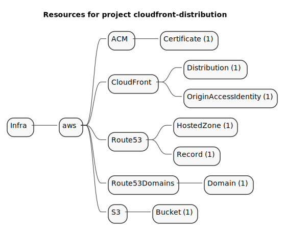
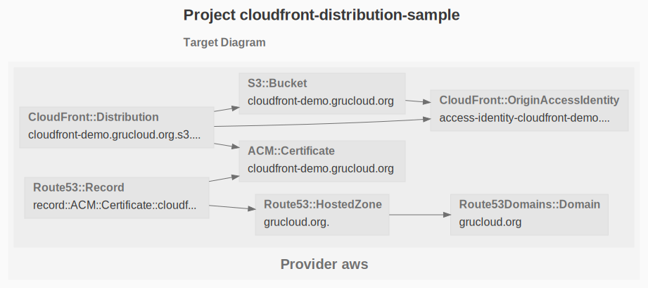

# Cloudfront with Origin Access Identity

The examples demonstrates the use of Origin Access Identity to allow a CloudFront distribution to access one or more S3 Bucket.

## Resources

Here is the list of the resources involved in this deployment:



Not let's see the relationship between these resources:

```sh
gc graph
```



## Requirements


## Workflow


### Route53Domain

To achieve full automation of this deployment, register or transfer a domain to Route53.

Verify that the domain is registered on Route53 with the following command:

```
gc list --types Route53Domain
```
