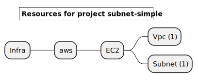
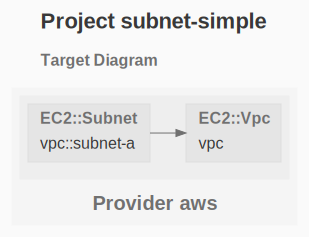

# EC2 Subnet

The purpose of this example is to deploy a subnet inside a non default VPC.

See the [AWS Getting Started](https://www.grucloud.com/docs/aws/AwsGettingStarted)

```sh
gc tree
```



```sh
gc graph
```



# Workflow

Here are the steps to deploy, destroy and document this infrastructure:


