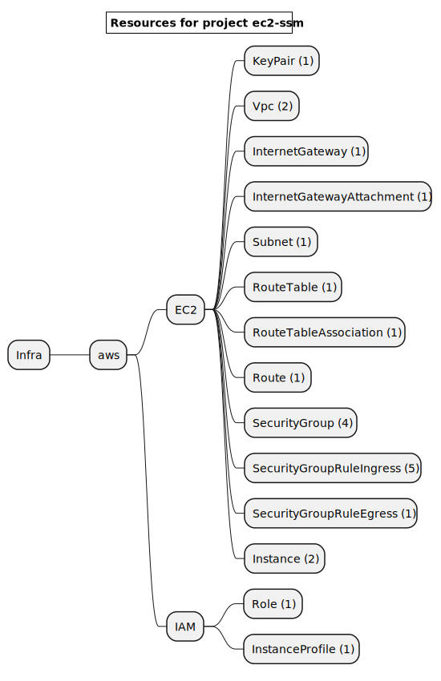
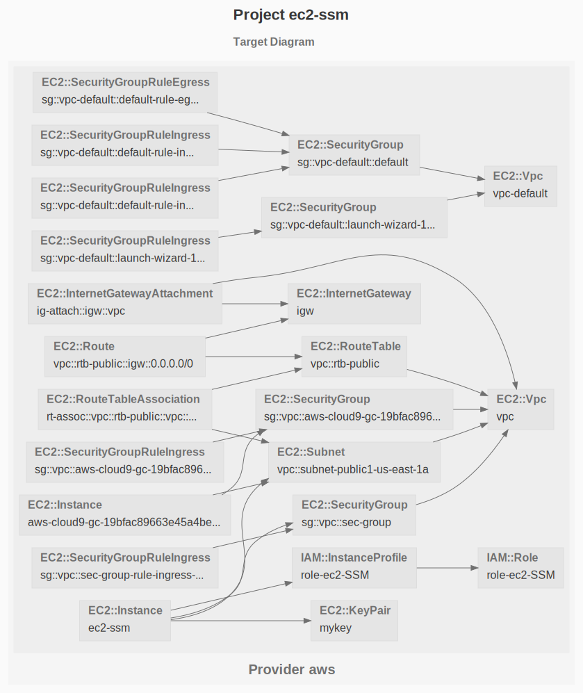

# EC2 with SSM

Connect an EC2 instance without public address with the Session Manager.


```sh
gc tree
```



```sh
gc graph
```



# Workflow

Here are the steps to deploy, destroy and document this infrastructure:


