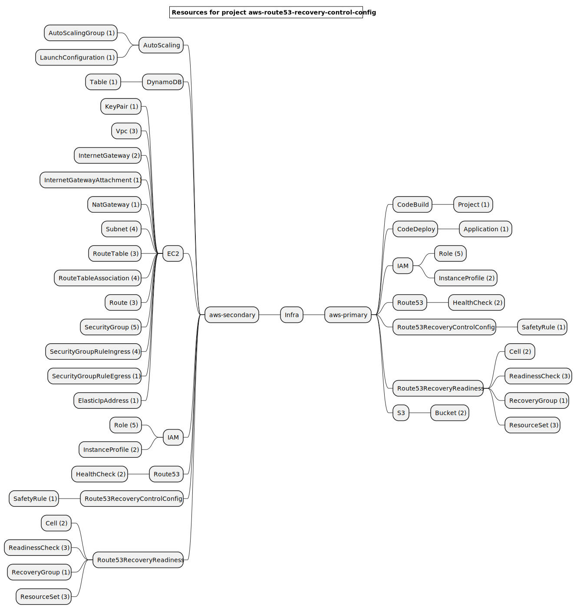
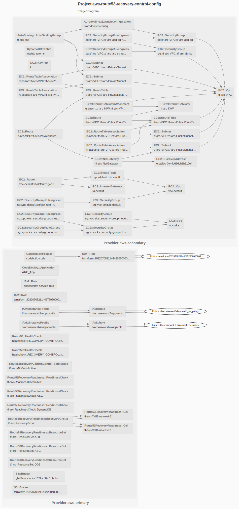

# Route53 Recovery Controller

This example originates from [aws-ia/terraform-aws-route53-recovery-controller](https://github.com/aws-ia/terraform-aws-route53-recovery-controller)

## Resources mind map

## Target Graph

