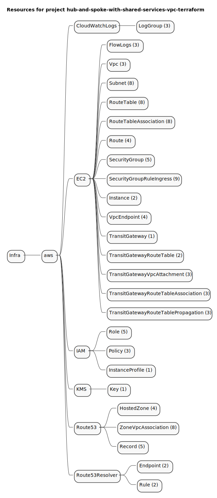
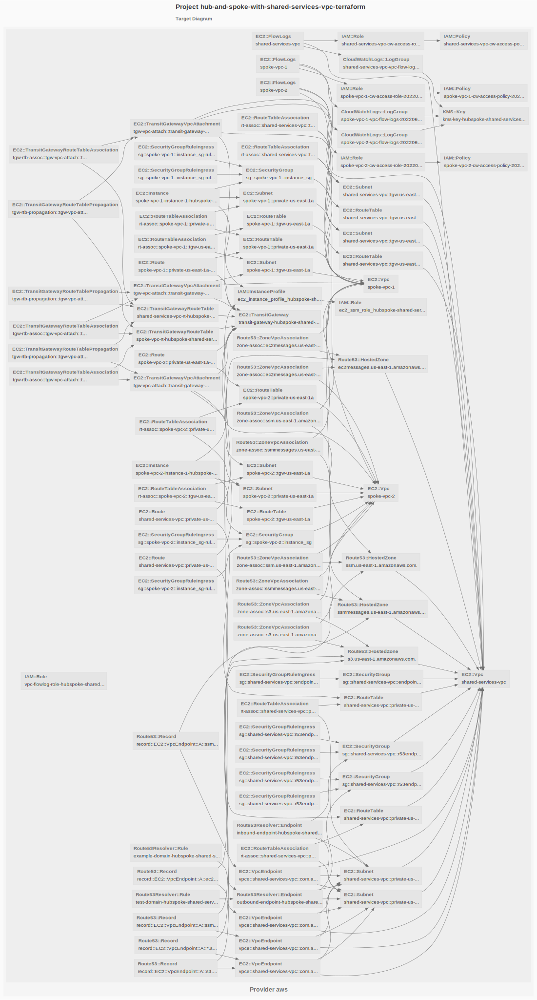

# hub-and-spoke-with-shared-services-vpc-terraform

Example taken from [hub-and-spoke-with-shared-services-vpc-terraform](https://github.com/aws-samples/hub-and-spoke-with-shared-services-vpc-terraform)

## Resources mind map

## Target Graph

