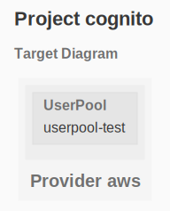
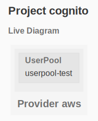

# Cognito

The purpose of this example is to show off AWS Cognito

See the [AWS Getting Started](https://www.grucloud.com/docs/aws/AwsGettingStarted)

## Dependency Graph

```sh
gc graph
```



## Live diagram

```sh
gc list --graph
```


