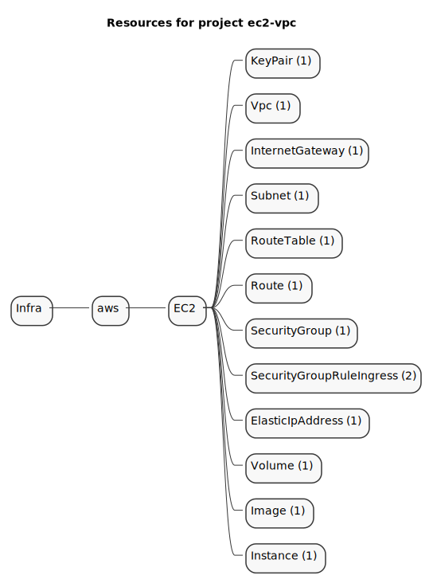
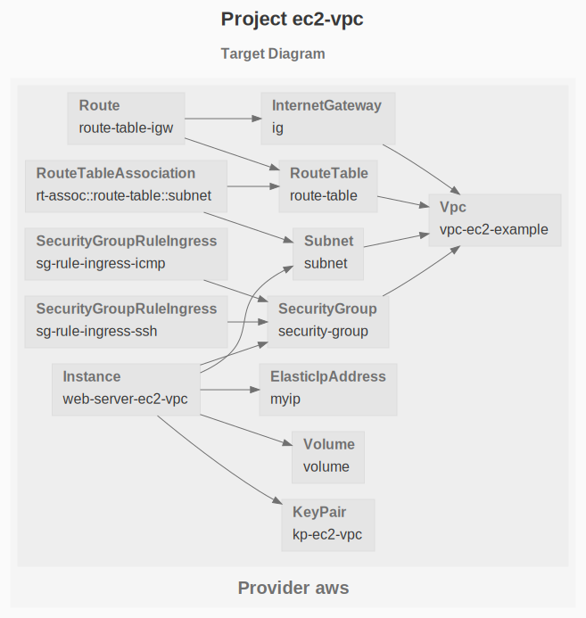

# EC2 - VPC

The purpose of this example is to deploy an EC2 instance attached to an elastic public IP address, inside a VPC, secured by firewall rules with a security group.

```sh
gc tree
```



```sh
gc graph
```


