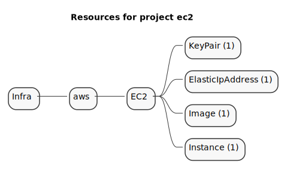

# EC2

The purpose of this example is to deploy an EC2 instance attached to an elastic public IP address.

See the [AWS Getting Started](https://www.grucloud.com/docs/aws/AwsGettingStarted)

```sh
gc tree
```



```sh
gc graph
```


