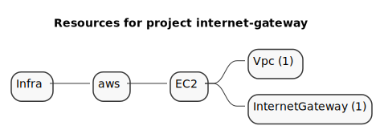
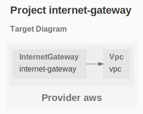

# EC2 - Internet Gateway

The purpose of this example is to deploy an EC2 Internet Gateway.

```sh
gc tree
```



```sh
gc graph
```



# Workflow

Here are the steps to deploy, destroy and document this infrastructure:


