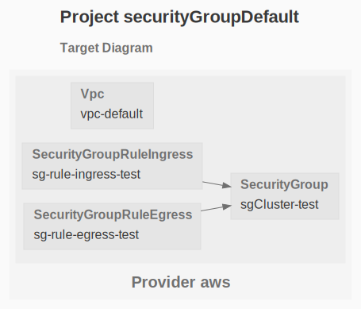

# EC2

The purpose of this example is to deploy security group rules in the default security group

See the [AWS Getting Started](https://www.grucloud.com/docs/aws/AwsGettingStarted)

```sh
gc tree
```


```sh
gc graph
```


