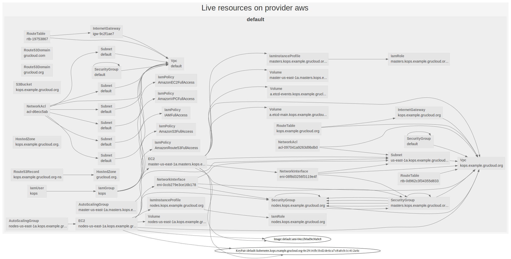

# KOPS on AWS with GruCloud

This GrucCloud code automatically create and destroy the users, groups, S3 bucket, and route53 dns record required by [kops](https://kops.sigs.k8s.io/), a tool to create Kubernetes cluster.

We'll refer to the [kops guide for AWS](https://kops.sigs.k8s.io/getting_started/aws/).

Regarding ths DNS settings, we implement the case of a subdomain where a top level hosted zone already exists.

## TD;DR

1. Get the boilerplate code and install the dependencies.
2. Edit the configuration file and set the domain name and subdomain name.
3. `gc apply`

All the AWS resources required by kops should have been created. The environment file _kops.env_ containing the necessary information is also generated.

You are now ready to create a cluster with kops.

Here are a few npm scripts wrapper: `npm run kops:create`, `npm run kops:update` and `npm run kops:validate`.

## Requirements

- [Access the the AWS console](https://console.aws.amazon.com)
- AWS CLI configured
- A domain name registered on Route53
- [Node.js](https://nodejs.org)
- [GruCloud CLI](https://www.grucloud.com/docs/cli/gc)

## Install

Install the npm dependencies with the _install_ command:

```sh
npm install
```

## Configuration

Edit [config.js](./config.js) and set the _domainName_ and _subDomainName_.

## iac.js

For your information, the architecture is described in [iac.js](./iac.js).

## Target Graph

Another way to explore the _iac.js_ is to generate a diagram of the resources:

```sh
gc graph
```


## Deploying

Ready to deploy the user, group, s3 bucket, route53 hosted zone and record ?

```sh
gc apply
```

Let's find out the list of live resources created by GrouCloud as well as a diagram showing the dependencies between the resources.

```sh
gc list --graph
```

```txt
List Summary:
Provider: aws
┌───────────────────────────────────────────────────────────────────────────────────────────────────────┐
│ aws                                                                                                   │
├────────────────────┬──────────────────────────────────────────────────────────────────────────────────┤
│ NetworkAcl         │ acl-d6ecc5ab                                                                     │
│                    │ acl-0edaac567955a3a1a                                                            │
│                    │ acl-0132f54ddc1279c50                                                            │
├────────────────────┼──────────────────────────────────────────────────────────────────────────────────┤
│ KeyPair            │ kubernetes.kops.example.grucloud.org-0e:29:14:fb:1b:d2:de:6c:a7:c8:a0:cb:1c:41:… │
├────────────────────┼──────────────────────────────────────────────────────────────────────────────────┤
│ NetworkInterface   │ eni-00125f14983089e55                                                            │
│                    │ eni-00269f773890846bf                                                            │
├────────────────────┼──────────────────────────────────────────────────────────────────────────────────┤
│ IamPolicy          │ AmazonEC2FullAccess                                                              │
│                    │ AmazonRoute53FullAccess                                                          │
│                    │ AmazonS3FullAccess                                                               │
│                    │ IAMFullAccess                                                                    │
│                    │ AmazonVPCFullAccess                                                              │
├────────────────────┼──────────────────────────────────────────────────────────────────────────────────┤
│ Volume             │ a.etcd-main.kops.example.grucloud.org                                            │
│                    │ a.etcd-events.kops.example.grucloud.org                                          │
│                    │ master-us-east-1a.masters.kops.example.grucloud.org                              │
│                    │ nodes-us-east-1a.kops.example.grucloud.org                                       │
├────────────────────┼──────────────────────────────────────────────────────────────────────────────────┤
│ Route53Domain      │ grucloud.com                                                                     │
│                    │ grucloud.org                                                                     │
├────────────────────┼──────────────────────────────────────────────────────────────────────────────────┤
│ IamRole            │ masters.kops.example.grucloud.org                                                │
│                    │ nodes.kops.example.grucloud.org                                                  │
├────────────────────┼──────────────────────────────────────────────────────────────────────────────────┤
│ S3Bucket           │ kops.example.grucloud.org                                                        │
├────────────────────┼──────────────────────────────────────────────────────────────────────────────────┤
│ IamGroup           │ kops                                                                             │
├────────────────────┼──────────────────────────────────────────────────────────────────────────────────┤
│ IamInstanceProfile │ masters.kops.example.grucloud.org                                                │
│                    │ nodes.kops.example.grucloud.org                                                  │
├────────────────────┼──────────────────────────────────────────────────────────────────────────────────┤
│ HostedZone         │ grucloud.org.                                                                    │
│                    │ kops.example.grucloud.org.                                                       │
├────────────────────┼──────────────────────────────────────────────────────────────────────────────────┤
│ IamUser            │ kops                                                                             │
├────────────────────┼──────────────────────────────────────────────────────────────────────────────────┤
│ Route53Record      │ kops.example.grucloud.org-ns                                                     │
├────────────────────┼──────────────────────────────────────────────────────────────────────────────────┤
│ Vpc                │ default                                                                          │
│                    │ kops.example.grucloud.org                                                        │
├────────────────────┼──────────────────────────────────────────────────────────────────────────────────┤
│ InternetGateway    │ kops.example.grucloud.org                                                        │
│                    │ igw-9c2f1ae7                                                                     │
├────────────────────┼──────────────────────────────────────────────────────────────────────────────────┤
│ Subnet             │ us-east-1a.kops.example.grucloud.org                                             │
│                    │ default                                                                          │
│                    │ default                                                                          │
│                    │ default                                                                          │
│                    │ default                                                                          │
│                    │ default                                                                          │
│                    │ subnet1-test-load-balancer                                                       │
│                    │ default                                                                          │
│                    │ subnet2-test-load-balancer                                                       │
├────────────────────┼──────────────────────────────────────────────────────────────────────────────────┤
│ SecurityGroup      │ default                                                                          │
│                    │ default                                                                          │
│                    │ masters.kops.example.grucloud.org                                                │
│                    │ nodes.kops.example.grucloud.org                                                  │
│                    │ default                                                                          │
├────────────────────┼──────────────────────────────────────────────────────────────────────────────────┤
│ RouteTable         │ rtb-19753867                                                                     │
│                    │ rtb-0d1d24e2564fd421d                                                            │
│                    │ rtb-04b0fb8968d8fc5ba                                                            │
│                    │ kops.example.grucloud.org                                                        │
├────────────────────┼──────────────────────────────────────────────────────────────────────────────────┤
│ EC2                │ nodes-us-east-1a.kops.example.grucloud.org                                       │
│                    │ master-us-east-1a.masters.kops.example.grucloud.org                              │
├────────────────────┼──────────────────────────────────────────────────────────────────────────────────┤
│ AutoScalingGroup   │ master-us-east-1a.masters.kops.example.grucloud.org                              │
│                    │ nodes-us-east-1a.kops.example.grucloud.org                                       │
└────────────────────┴──────────────────────────────────────────────────────────────────────────────────┘
57 resources, 21 types, 1 provider
Command "gc l -g -a" executed in 8s
```


## Envirornment variables

At the end of the deployment, the environment file **kops.env** is generated with the variables required by _kops_:

```sh
# kops.env
export AWS_ACCESS_KEY_ID=XXXXXXNBM2ZQEPXXXXX
export AWS_SECRET_ACCESS_KEY=XXXXXiXmSB3aZTK/AxOOvSPcGby3XXXXXX
export NAME=kops.example.grucloud.org
export KOPS_STATE_STORE=s3://kops.example.grucloud.org
```

Source with variables with:

```sh
source kops.env
```

When the deploment is destroyed with _gc destroy_, **kops.env** is removed.

The file [hook.js](./hook.js) is the place where this logic is implemented

## NPM kops scripts

The following npm scripts manage the kops commands, the environment variables are sourced from **kops.env** and given to **kops**.

```sh
npm run kops:create
npm run kops:update
npm run kops:validate
```

## List Resources

Let's fetch all the live resources, we'll see that _kops_ creates many resources such as autoscaling groups, ec2 instances, subnets, vpc, internet gateway, volumes and so on:

```sh
gc list --graph --all
```



## Destroy

To destroy the resources created by GruCloud, use the _destroy_ command.

> Ensure the cluster is destroyed before.

```sh
npm run kops:destroy
gc destroy
```
