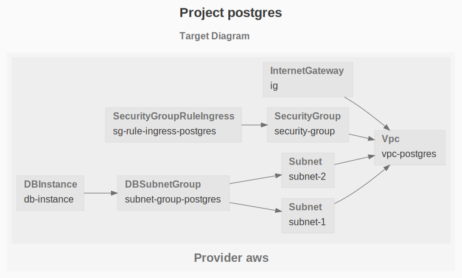

# RDS Postgres

The purpose of this example is to deploy a postgres database with RDS, accesible publicly.

## Dependency Graph

```sh
gc graph
```



## Configuration

The postgres username and password are defined in [default.env](default.env), ensure this file is not commited into a source code repository, i.e add `default.env` into `.gitignore`.

The remaining config is located at [config.js](config.js)
