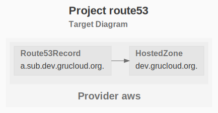

# Route53

The purpose of this example is to create an hosted zone and add some records.

## Resources

- [HostedZone](https://www.grucloud.com/docs/aws/resources/Route53/Route53HostedZone)
- [Record](https://www.grucloud.com/docs/aws/resources/Route53/Route53Record)

## Dependency Graph

```sh
gc graph
```


