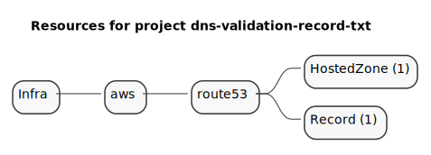
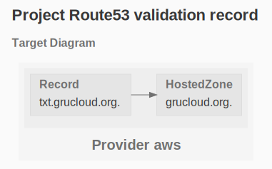

# DNS validation with a TXT record

The purpose of this example is to validate a website domain by DNS validation.
A TXT record will be created for that purpose.

```sh
gc tree
```



```sh
gc graph
```


