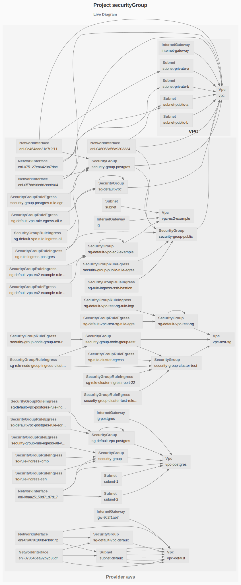

# EC2

The purpose of this example is to deploy a security group and rules

See the [AWS Getting Started](https://www.grucloud.com/docs/aws/AwsGettingStarted)

## Dependency Graph

```sh
gc graph
```


## Live diagram

```sh
gc list
```


