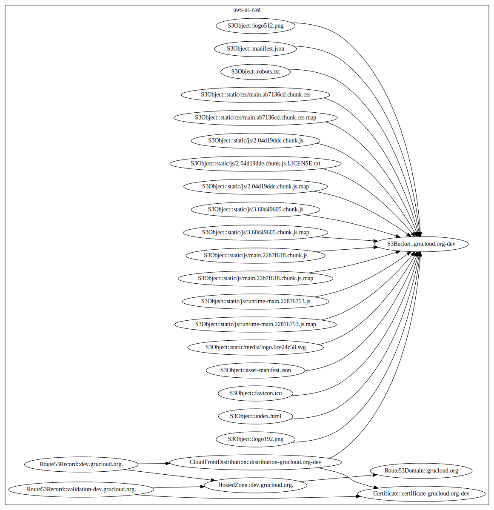

# HTTPS Website on AWS

The purpose of this example is to deploy a secure static website on AWS accessible with a DNS name: https://mydomain.com

## Config

Edit [config/default.js](./config/default.js) and set the following parameters:

- **DomainName**: the website domain name managed by **Route53**
- **websiteDir**: the directory where the website is located.

## Resources

Here is the list of the resources involved in this deployment:

- [S3Bucket](https://www.grucloud.com/docs/aws/resources/S3/S3Bucket): creates a bucket with the correct website configuration and ACL.
- [S3Object](https://www.grucloud.com/docs/aws/resources/S3/S3Object): an S3 Object is created for each of the files in the **websiteDir** directory.
- [Certificate](https://www.grucloud.com/docs/aws/resources/ACM/AcmCertificate): provides an HTTPS Certificate for the given **DomainName**. The Verification is using the DNS method by adding a specific _CNAME_ entry.
- [HostedZone](https://www.grucloud.com/docs/aws/resources/Route53/Route53HostedZone): setup an _HostedZone_ to hold multiple _Route53Record_
- [Route53Record](https://www.grucloud.com/docs/aws/resources/Route53/Route53Record): 2 records are created, one _CNAME_ record for the certicate validation, and one _A_ record with _AliasTarget_ given by the _CloudFrontDistribution_
- [Route53Domain](https://www.grucloud.com/docs/aws/resources/Route53Domain/Route53Domain): The DNS server will be updated from the servers returned by the _HostedZone_.
- [CloudFrontDistribution](https://www.grucloud.com/docs/aws/resources/CloudFront/CloudFrontDistribution): Serves the S3 objects with the HTTPS Certificate.

## Dependency Graph



## Requirements

### Node

Node 14 is required to run the GruCloud CLI:

```
node -v
```

### GruCloud Cli

Install the GruCloud CLI called **gc** is installed:

```
npm i -g @grucloud/core
```

### Aws Cli, Access and Secret Key

Ensure the aws cli is installed and configured: [AwsRequirements](https://www.grucloud.com/docs/aws/AwsRequirements)

### Route53Domain

To achieve full automation of this deployment, register or transfer a domain to Route53.

Verify that the domain is registered on Route53 with the following command:

```
gc list  --types Route53Domain
```

## Commands

Here the 4 main commands for a regular workflow:

- [gc plan](https://www.grucloud.com/docs/cli/PlanQuery): Find out what is going to be installed.
- [gc apply](https://www.grucloud.com/docs/cli/PlanApply): Deploy the resources.
- [gc list](https://www.grucloud.com/docs/cli/List): List the live resources.
- [gc destroy](https://www.grucloud.com/docs/cli/PlanDestroy): Destroy the resources.

<iframe
data-autoplay
src="https://asciinema.org/a/VNjhjXHwRhGkuP6kcMBks3Kmo/embed?autoplay=true&amp;speed=6&amp;loop=true"
id="asciicast-iframe-13761"
name="asciicast-iframe-13761"
scrolling="no"
style={{ width: "900px", height: "720px" }}
></iframe>
