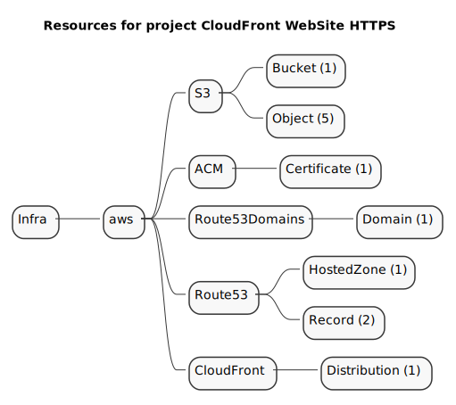
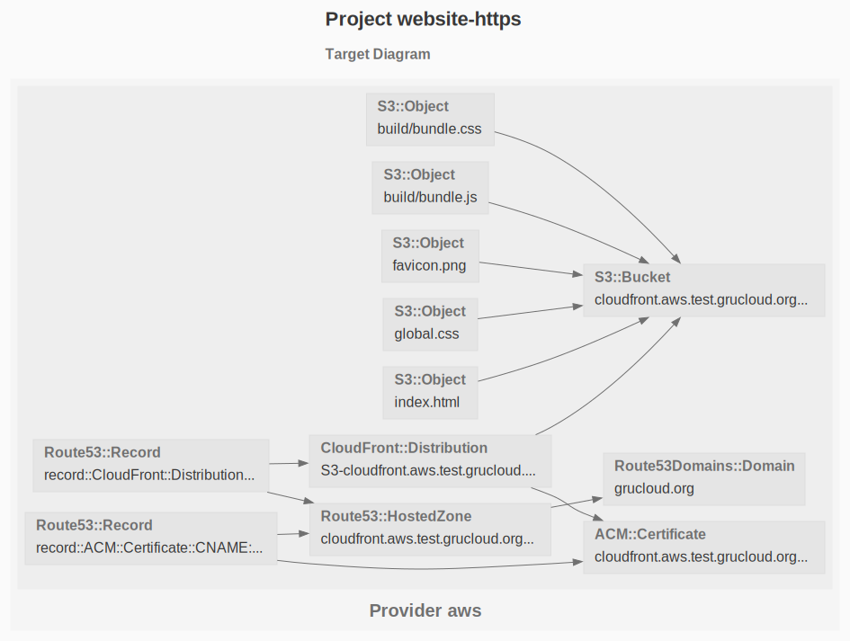

# HTTPS Website with AWS Cloudfront

The purpose of this example is to deploy a secure static website on AWS accessible with a DNS name: https://mydomain.com

## Resources

Here is the list of the resources involved in this deployment:



- [S3Bucket](https://www.grucloud.com/docs/aws/resources/S3/Bucket): creates a bucket with the correct website configuration and ACL.
- [S3Object](https://www.grucloud.com/docs/aws/resources/S3/Object): an S3 Object is created for each of the files in the **websiteDir** directory.
- [Certificate](https://www.grucloud.com/docs/aws/resources/ACM/Certificate): provides an HTTPS Certificate for the given **DomainName**. The Verification is using the DNS method by adding a specific _CNAME_ entry.
- [HostedZone](https://www.grucloud.com/docs/aws/resources/Route53/HostedZone): setup an _HostedZone_ to hold multiple _Route53Record_
- [Route53Record](https://www.grucloud.com/docs/aws/resources/Route53/Record): 2 records are created, one _CNAME_ record for the certicate validation, and one _A_ record with _AliasTarget_ given by the _CloudFrontDistribution_
- [Route53Domain](https://www.grucloud.com/docs/aws/resources/Route53Domain/Domains): The DNS server will be updated from the servers returned by the _HostedZone_.
- [CloudFrontDistribution](https://www.grucloud.com/docs/aws/resources/CloudFront/Distribution): Serves the S3 objects with the HTTPS Certificate.

```sh
gc graph
```



## Config

Edit [config.js](./config.js) and set the following parameters:

- **rootDomainName**: the top level domain name managed by **Route53**
- **DomainName**: the website sub-domain
- **websiteDir**: the directory where the website is located.

> The region must be set to **us-east-1** due to a CloudFront limitation.

## Requirements


## Workflow


### Route53Domain

To achieve full automation of this deployment, register or transfer a domain to Route53.

Verify that the domain is registered on Route53 with the following command:

```
gc list --types Route53Domain
```
