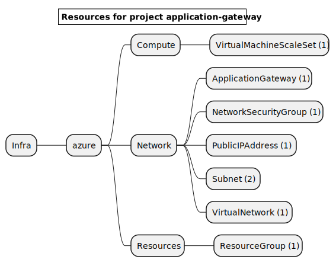
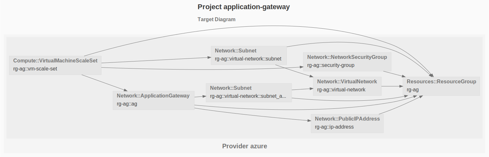

# Azure Application Gateway

The Azure Application Gateway is a Layer 7 load balancer suitable for regional HTTP/HTTPS traffic.

See the [Azure Getting Started](https://www.grucloud.com/docs/azure/AzureGettingStarted)

```sh
gc tree
```



```sh
gc graph
```


