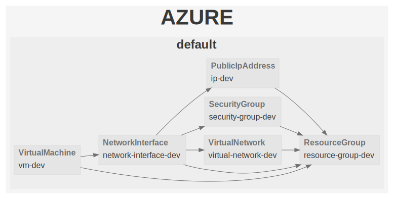

# VM - VPC

The purpose of this example is to deploy an virtual machine instance attached to an elastic public IP address, inside a VPC, secured by firewall rules.

## Dependency Graph

```sh
gc graph
```


