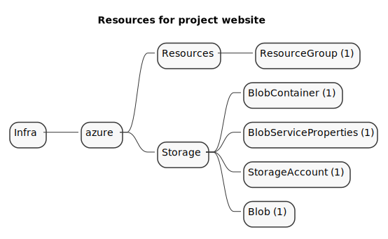
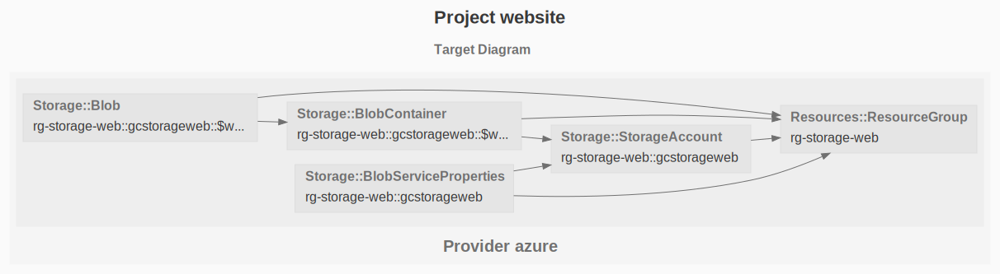

# Azure Blob Storage Static Website

This example deploys _index.hml_ as a static website inside a storage account.

See the [Azure Getting Started](https://www.grucloud.com/docs/azure/AzureGettingStarted)

```sh
gc tree
```



```sh
gc graph
```


