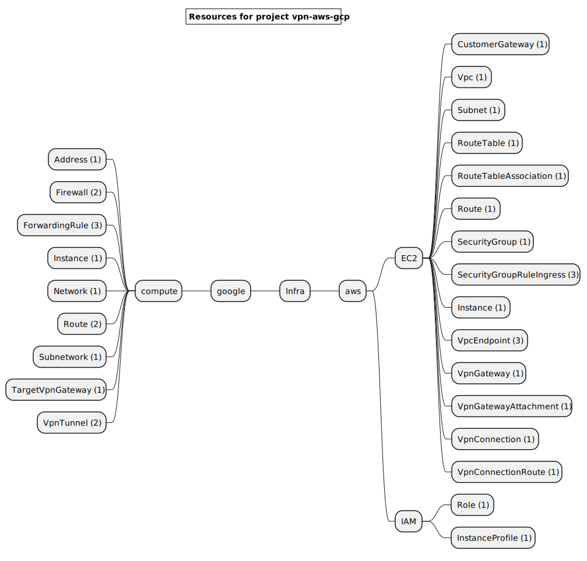
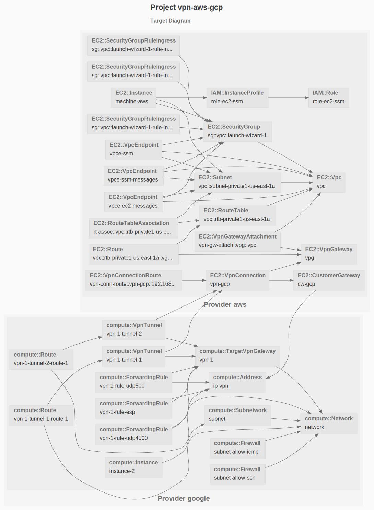

# VPN between Google and AWS

This example deploys a VPN tunnel between AWS and Google Cloud.

```sh
gc tree
```



```sh
gc graph
```



# Workflow

Here are the steps to deploy, destroy and document this infrastructure:


