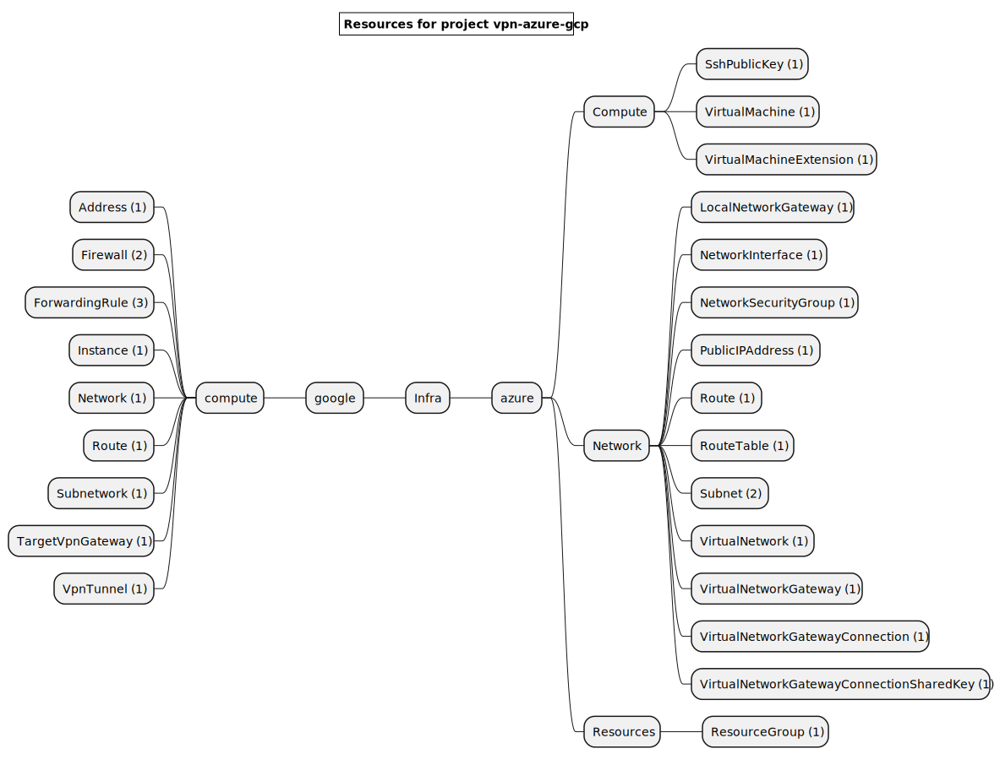
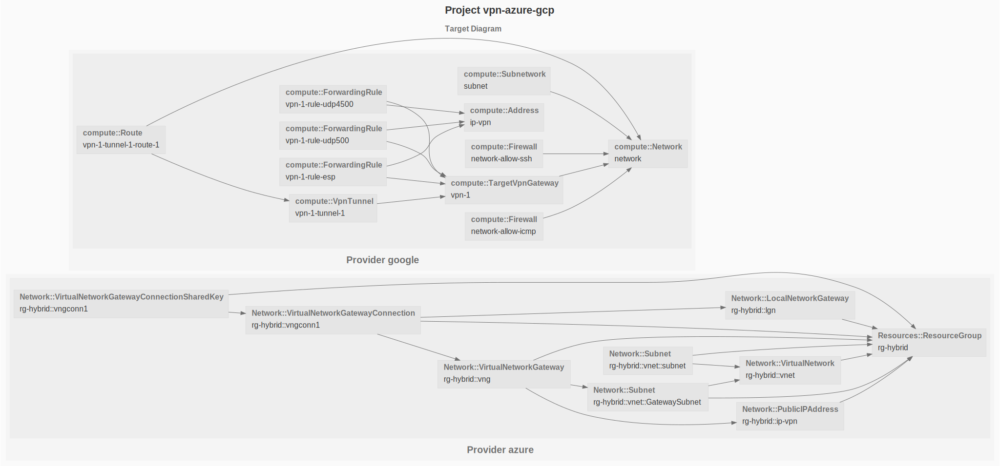

# VPN between Azure and Google

This example deploys a VPN tunnel between Azure and Google Cloud.

# ClickOps - Manual Steps

### Azure VPN Part 1

#### Azure Virtual Network

- Search for `Virtual networks` in [Azure portal](https://portal.azure.com) search bar
- Click on `Create Virtual Network`
- Select the subscription
- Create or select a resource group, for instance `rg-hybrid`
- Enter a virtual network name, for instance `vnet`
- Select a region
- Click on `Next IP Addresses`
- Fill the `IPv4 address space`, for instance `172.16.0.0/16`
- Add a subnet called `GatewaySubnet` with the CIDR `172.16.2.0/28`
- Ass a subnet called, for instance `subnet` with the CIDR `172.16.1.0/24`
- Click on on `Review + Create`
- Click on `Create`

#### Azure Virtual Network Gateway

- Search for `Virtual network gateways` in [Azure portal](https://portal.azure.com) search bar
- Click on `Create`
- Select the subscription
- Select a region
- Select a name, for instance `vng`
- Select the SKU `VpnGw1`
- Select the virtual network previously created
- Enter a `Public IP address name` such as `ip-vpn`
- Click on on `Review + Create`
- Click on `Create`
- Find out the Azure public ip address required to create the GCP VPN.

#### Route Table

- Search for `Route tables` in [Azure portal](https://portal.azure.com) search bar
- Click on `Create`
- Select the subscription
- Select Resource group
- Enter a route table name, for instance `rtb-gcp`
- Click on `Review + Create`
- Click on `Create`

### Route

- Select the newly created the route table
- Click on the `Routes` tab
- Click on `Add`
- Enter a route name such as `route-gcp`
- Enter the GCP subnet CIDR: `192.168.0.0/24`
- Select `Virtual Network Gateway` from the _Next Hop Type_ dropdown

### GCP VPN Part 1

#### GCP Network

- Visit the [GCP networks page](https://console.cloud.google.com/networking/networks/list)
- Click on `CREATE VPC NETWORK`
- Enter a name such as `network`

Let's create a subnet:

- Enter a subnet name such as `subnet`
- Select a region
- Enter a IPv4 range such as `192.168.0.0/24`
- Click on `DONE` to create the subnet
- According to your use case, assign firewall rules to permit traffic, for instance ICMP ans SSH in this example.
- Finally, click on `CREATE` to create the network

#### GCP static ip address

- Visit the [GCP addresses page](https://console.cloud.google.com/networking/addresses/list)
- Click on `RESVERVE EXTERNAL IP ADDRESSES`
- Enter a name such as `ip-vpn`
- Click on `RESERVE`
- Copy the IP address to the clipboard, this ip is needed to create the Azure Local Network Gateway

### Azure VPN Part 2

#### Local network gateway

Create at many local network gateways than VPN tunnels:

- Search for `Local network gateways` in [Azure portal](https://portal.azure.com) search bar
- Click on `Create`
- Select the subscription
- Select a region
- Enter a name, for instance `lgngw1`
- Enter the google public IP address for a given tunnel
- Enter the google subnet CIDR, for instance `192.168.0.0/16`

### Virtual Network Gateway Connection

- Search for `Virtual network gateways` in [Azure portal](https://portal.azure.com) search bar
- Click on the previously created virtual network gateway to edit its details
- Click on `Connections` tabs
- Click on `Add`
- Enter a name such as `vngconn1`
- Select `Site-to-site (IPsec)` as the connection type
- Select a Local Network Gateway
- Enter a random shared keys and save it for the other cloud.

### GCP VPN Part 2

#### Google Hybrid VPN

- Visit the [GCP hybrid vpn](https://console.cloud.google.com/hybrid/vpn/list?tab=tunnels)
- Create `VPN CONNECTION`
- Select `Classic VPN`
- Click on `CONTINUE`

- Select the previously created network
- Select the previously created ip address

Repeat the steps for the 2 tunnels:

- In the _Remote Peer IP address_, enter the google public address for the given tunnel
- In the _IKE pre-shared key_, enter the pre-shared key used by the other cloud provider.
- Select `Route based`
- Enter the Azure VPC CIDR in the _Remote network IP ranges_ input, such as `172.16.0.0/16`

- Finally, click on `CREATE` to create the VPN connection

After a few minutes, the vpn gateway should be up and running.

Click on the vpn gateway and check the vpn tunnel status which should be in the _Established_ state.

### Azure Virtual Machine

# Workflow

Here are the steps to deploy, destroy and document this infrastructure:

