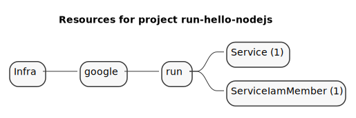
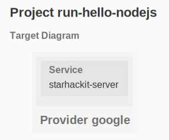

# GCP Cloud Run

Deploy containers with [Cloud Run](https://cloud.google.com/run).

Cloud Run is a managed service to run containers in a scalable manner without to worry about the underlying infrastructure: no control plane to manage, no load balancer to create, no machine type to select.

Just specify a few paramaters such as

- container name and version
- max cpu and memory
- http port to use.

Cloud Run will take care of provisioning and scaling the infrastructure on your behalf.

## Resource Diagrams

### Resources Mind map

```sh
gc tree
```



### Resources Dependency Diagram

```sh
gc graph
```



## Workflow


