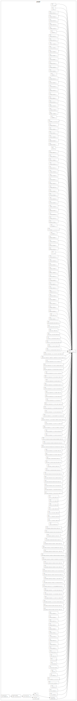

# Hosting a secure static website

The example automates the deployment of a static website served with HTTPS.

See the manual way at [hosting static website](https://cloud.google.com/storage/docs/hosting-static-website)

## Requirement

For this example, register and verify a domain name with your favorite domain registrar.

## Install

Install the npm dependencies:

```sh
npm install
```

## Config

Edit [config.js](config.js) and set the following variable:

- _projetName_: the project name.
- _bucketName_: the bucket name which is also the domain name, i.e. mywebsite.com
- _websiteDir_: the directory containing the static website.

## Initialise

The _init_ command will create the project, setup the billing, enable the api services, create the service account and its credentials file, and bind the IAM roles to this service account

```
gc init
```

## Add the service account as the domain owner

The service account operating by grucloud need to be added as the domain owner.

This service account created previously with the **init** command is in the form of grucloud@**YourProjectId**.iam.gserviceaccount.com

Follow the manual steps at the [domain name verification documentation](https://cloud.google.com/storage/docs/domain-name-verification).

> Google does not provide any API to automate this step.

## Deploy

Deploy this infrastucture with the _apply_ command

```
gc apply
```

At this stage, the _onDeployed_ hook will not succeed.

At the moment a manual operation is required, you need to tell your registrar to point to the google dns server.
To find out the google dns server:

```
gc list --types Dns
```

Alternatively, use the _output_ command:

```
gc output -n dns-managed-zone -f nameServers
```

```
[
  'ns-cloud-e1.googledomains.com.',
  'ns-cloud-e2.googledomains.com.',
  'ns-cloud-e3.googledomains.com.',
  'ns-cloud-e4.googledomains.com.'
]
```

With these dns servers in hand, go to your registar and tell it to us these dns servers.

To check that the deployment is successful, run the `run --onDeployed` command:

```
 gc run --onDeployed
```

## Dependency Graph

```sh
gc graph
```


