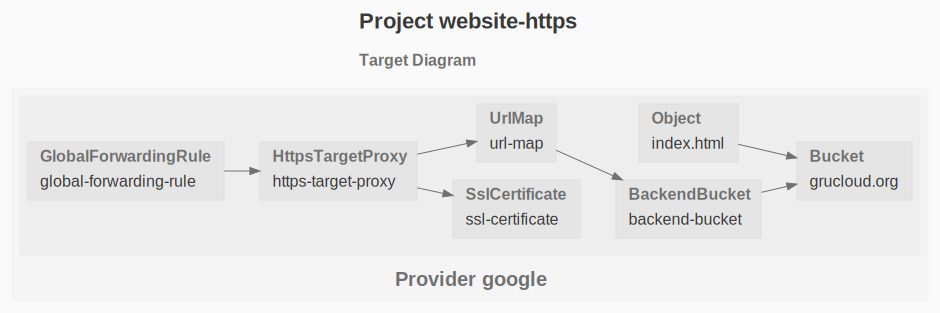

# Hosting a secure static website on GCP

The example automates the deployment of a static website served with HTTPS on GCP.

See the manual way at [hosting static website](https://cloud.google.com/storage/docs/hosting-static-website)

This deployment is composed of the resources depicted in the following diagram:



> The command `gc graph` generates this diagram from the target code.

## Requirements

[Google Domain](https://domains.google/) does not provide API, and the other google DNS service [Cloud Domain](https://cloud.google.com/domains/docs/overview) does not support transfering a domain.

For this reason, this example uses _AWS Route53_.

The [hook.js](./hook.js) file adds and removes a dns record of type A to map the domain name to the load balancer's IP address.

### Node

The GruCloud CLI is written in Javascript and runs with [Node.js](https://nodejs.org)

```sh
node -v
```

```
v14.15.3
```

### GruCLoud CLI

Install **gc**, the GruCloud CLI:

```sh
npm i -g @grucloud/core
```

Check **gc** is installed correclty:

```sh
gc -v
```

```
1.19.1
```

### AWS CLI

Enure the AWS CLI is installed as it will be invoked in the [hook.js](./hook.js) to add and remove a dns record to map the domain name to the load balancer's IP address.

```sh
aws --version
```

```txt
aws-cli/2.0.10 Python/3.7.4 Darwin/19.3.0 botocore/2.0.0dev14
```

### Route53 Domain

Let's verify that the aws account has a domain name registered:

```sh
aws route53domains list-domains --region us-east-1
```

```txt
{
    "Domains": [
        {
            "DomainName": "grucloud.org",
            "AutoRenew": true,
            "TransferLock": false,
            "Expiry": "2021-11-16T13:56:10+01:00"
        }
    ]
}
```

Alternatively, see the [Route53 Domain Listing](https://console.aws.amazon.com/route53/home#DomainListing)

### Route53 Hosted Zone

Create an Hosted Zone to later on add the DNS record of type A:

```sh
aws route53 create-hosted-zone --name grucloud.org --caller-reference 2021-06-30-2
```

You could also visit the [Route53 Dashboard](https://console.aws.amazon.com/route53/v2/home#Dashboard)

## Install

Install the npm dependencies:

```sh
npm install
```

## Config

Edit [config.js](config.js) and set the following variables:

- _projectId_: the project Id, must be unique, see restrictions [here](https://cloud.google.com/resource-manager/docs/creating-managing-projects#:~:text=The%20project%20ID%20must%20be,used%20for%20a%20deleted%20project.)
- _bucketName_: the bucket name which is also the domain name, i.e. mywebsite.com or subdomain.mywebsite.com, see the [bucket naming guideline](https://cloud.google.com/storage/docs/naming-buckets)
- _websiteDir_: the directory containing the static website.

## Initialise

The _init_ command will create the project, setup the billing, enable the api services, create the service account and its credentials file, and bind the IAM roles to this service account

```
gc init
```

## Add the service account as the domain owner

The service account operating by grucloud need to be added as the domain owner.

This service account created previously with the **init** command is in the form of grucloud@**YourProjectId**.iam.gserviceaccount.com

This service account is also stored in the generated credential file as the **client_email** property.
To find out where the credential file is located:

```sh
gc info
```

```txt
  - provider:
      name: google
      type: google
    stage: dev
    projectId: grucloud-test
    projectName: grucloud-test
    applicationCredentialsFile: /Users/yourusername/.config/gcloud/your-project-id.json
    serviceAccountName: grucloud
    hasGCloud: true
    config:
      bucketName: grucloud.org
      websiteDir: ./websites/simple
      managedByTag: -managed-by-gru
      managedByKey: managed-by
      managedByValue: grucloud
      region: europe-west4
      zone: europe-west4-a
```

Follow the manual steps at the [domain name verification documentation](https://cloud.google.com/storage/docs/domain-name-verification).

### Deploy

Deploy this infrastucture with the _apply_ command

```
gc apply
```

At the end of the deployment of the GCP resources, the _onDeployed_ hook is invoked.

First, a DNS type A record is added to map the domain name to the load balancer's IPv4 address, i.e the _GlobalForwardingRule_ resource.

The SSL certificate is waiting for this record to verify the ownership of the domain. It may take a few minutes for the SSL certificate to be ready.

The last stage is to get the webpage with HTTPS.
It ensures the deployment is completed successfuly.

### List the resources.

Verity the state of the resource with the **gc list** command, the _--graph_ generates a graph of the live resources.

```sh
gc list --graph
```

### Destroy

Dispose the infrastructure with:

```
gc destroy
```

```txt
┌─────────────────────────────────────────────────────────────────────────────┐
│ Destroy summary for provider google                                         │
├────────────────────┬────────────────────────────────────────────────────────┤
│ SslCertificate     │ ssl-certificate                                        │
├────────────────────┼────────────────────────────────────────────────────────┤
│ Bucket             │ grucloud.org                                           │
├────────────────────┼────────────────────────────────────────────────────────┤
│ BackendBucket      │ backend-bucket                                         │
├────────────────────┼────────────────────────────────────────────────────────┤
│ UrlMap             │ url-map                                                │
├────────────────────┼────────────────────────────────────────────────────────┤
│ HttpsTargetProxy   │ https-target-proxy                                     │
├────────────────────┼────────────────────────────────────────────────────────┤
│ GlobalForwardingR… │ global-forwarding-rule                                 │
└────────────────────┴────────────────────────────────────────────────────────┘
Destroying resources on 1 provider: google
✓ google
  ✓ Initialising
  ✓ Destroying
    ✓ SslCertificate 1/1
    ✓ Bucket 1/1
    ✓ BackendBucket 1/1
    ✓ UrlMap 1/1
    ✓ HttpsTargetProxy 1/1
    ✓ GlobalForwardingRule 1/1
  ✓ default::onDestroyed
    ✓ remove the load balancer A DNS record
6 resources destroyed, 6 types on 1 provider
Running OnDestroyedGlobal resources on 1 provider: google
Command "gc d -f" executed in 56s
```
