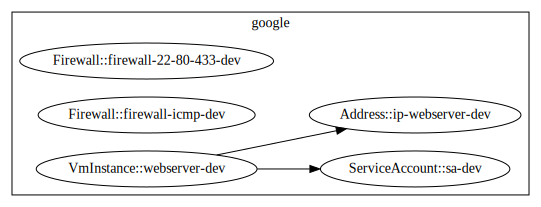

# Gcp VM

The purpose of this example is to deploy a virtual machine attached to a public IP address, protected by a firewall.

## Requirements

- Access to the [Google Cloud Console](https://console.cloud.google.com/)
- Node.js
- GruCloud CLI

## Dependency Graph

```sh
gc graph
```


