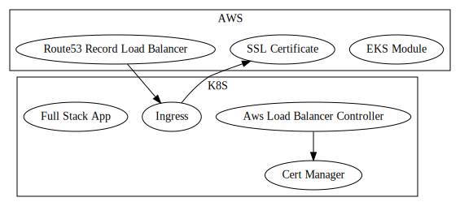

# Full Stack Application on AWS EKS with the AWS Load Balancer Controller

This example deploys a full-stack application with Kubernetes on AWS using their managed control plane called [Elastic Kubernetes Service](https://aws.amazon.com/eks/)

In this flavour, the AWS Application Load Balancer is created and destroyed by the [AWS Load Balancer Controller](https://docs.aws.amazon.com/eks/latest/userguide/aws-load-balancer-controller.html)

This infrastructure depends on 2 providers: AWS and Kubernetes.



## Modules

A few modules for each of these providers are being used.

### Modules for AWS resources

- [module-aws-certificate](https://www.npmjs.com/package/@grucloud/module-aws-certificate)
- [module-aws-vpc](https://www.npmjs.com/package/@grucloud/module-aws-vpc)
- [module-aws-eks](https://www.npmjs.com/package/@grucloud/module-aws-eks)
- [module-aws-load-balancer](https://www.npmjs.com/package/@grucloud/module-aws-load-balancer-controller)

### Modules for K8s resources

- [module-k8s-aws-load-balancer](https://www.npmjs.com/package/@grucloud/module-k8s-aws-load-balancer-controller)
- [module-k8s-cert-manager](https://www.npmjs.com/package/@grucloud/module-k8s-cert-manager)

## Amazon EKS

The first part of this deployment is to create an EKS control plan, a node group for the workers and all their numerous dependencies.

Configuration for the AWS resources is located at [configAws.js](./configAws.js)

Set the **rootDomainName** and **domainName** according to your use case

> For end to end automation, the **rootDomainName** should be registered or transfered to the AWS Route53 service.

## K8s

The second part is the kubernetes deployment of the full-stack application composed of a react front end, a node backend, postgres as the SQL database and finally redis for the cache and published/subscriber models.

Configuration for the K8s resources is located at [configK8s.js](./configK8s.js)

## Load Balancer Route53 Record

The third part of the deployment begins when the k8s ingress controller assigns a new hostname, we can now create a new Route53 record, of type _A_, using an _AliasTarget_.

## Troubleshooting

List the ingresses:

```sh
gc l -t Ingress
```

```
kubectl get po -A
```

```
kubectl describe pods  -n kube-system aws-load-balancer-controller-5c5c56786-q7tn4
```

```
kubectl logs -n kube-system   deployment.apps/aws-load-balancer-controller
```

Describe the _aws-load-balancer-controller_ service account with _kubectl_:

```sh
kubectl get sa/aws-load-balancer-controller -n kube-system
```

```sh
Name:                aws-load-balancer-controller
Namespace:           kube-system
Labels:              app.kubernetes.io/component=controller
                     app.kubernetes.io/name=aws-load-balancer-controller
Annotations:         CreatedByProvider: k8s
                     ManagedBy: GruCloud
                     Name: aws-load-balancer-controller
                     eks.amazonaws.com/role-arn: arn:aws:iam::840541460064:role/role-load-balancer
                     stage: dev
Image pull secrets:  <none>
Mountable secrets:   aws-load-balancer-controller-token-kxvd7
Tokens:              aws-load-balancer-controller-token-kxvd7
Events:              <none>
```

The same information can be obtain with _gc_

```
gc l -t ServiceAccount -n aws-load-balancer-controller
```

```
Listing resources on 2 providers: aws, k8s
✓ aws
  ✓ Initialising
  ✓ Listing
✓ k8s
  ✓ Initialising
  ✓ Listing 1/1
┌───────────────────────────────────────────────────────────────────────────────────────────────────────────────────┐
│ 1 ServiceAccount from k8s                                                                                         │
├──────────────────────────────┬─────────────────────────────────────────────────────────────────────────────┬──────┤
│ Name                         │ Data                                                                        │ Our  │
├──────────────────────────────┼─────────────────────────────────────────────────────────────────────────────┼──────┤
│ aws-load-balancer-controller │ metadata:                                                                   │ Yes  │
│                              │   name: aws-load-balancer-controller                                        │      │
│                              │   namespace: kube-system                                                    │      │
│                              │   selfLink: /api/v1/namespaces/kube-system/serviceaccounts/aws-load-balanc… │      │
│                              │   uid: e85bdaa1-4286-4307-b3be-3abbf660b91f                                 │      │
│                              │   resourceVersion: 9051                                                     │      │
│                              │   creationTimestamp: 2021-04-07T23:18:25Z                                   │      │
│                              │   labels:                                                                   │      │
│                              │     app.kubernetes.io/component: controller                                 │      │
│                              │     app.kubernetes.io/name: aws-load-balancer-controller                    │      │
│                              │   annotations:                                                              │      │
│                              │     CreatedByProvider: k8s                                                  │      │
│                              │     ManagedBy: GruCloud                                                     │      │
│                              │     Name: aws-load-balancer-controller                                      │      │
│                              │     eks.amazonaws.com/role-arn: arn:aws:iam::840541460064:role/role-load-b… │      │
│                              │     stage: dev                                                              │      │
│                              │ secrets:                                                                    │      │
│                              │   - name: aws-load-balancer-controller-token-kxvd7                          │      │
│                              │                                                                             │      │
└──────────────────────────────┴─────────────────────────────────────────────────────────────────────────────┴──────┘


List Summary:
Provider: aws
┌──────────────────────────────────────────────────────────────────────────────────────────────────────────────────┐
│ aws                                                                                                              │
└──────────────────────────────────────────────────────────────────────────────────────────────────────────────────┘
Provider: k8s
┌──────────────────────────────────────────────────────────────────────────────────────────────────────────────────┐
│ k8s                                                                                                              │
├────────────────────┬─────────────────────────────────────────────────────────────────────────────────────────────┤
│ ServiceAccount     │ aws-load-balancer-controller                                                                │
└────────────────────┴─────────────────────────────────────────────────────────────────────────────────────────────┘
1 resource, 1 type, 2 providers
Command "gc l -t ServiceAccount -n aws-load-balancer-controller" executed in 5s
```

Ensure this service account is linked to an IAM Role, check the value of `metadata.annotation['eks.amazonaws.com/role-arn']`

Let's view the _role-load-balancer_ IAM Role:

```sh
gc l -t IamRole -n role-load-balancer
```

```sh
Listing resources on 2 providers: aws, k8s
✓ aws
  ✓ Initialising
  ✓ Listing 2/2
✓ k8s
  ✓ Initialising
  ✓ Listing
┌─────────────────────────────────────────────────────────────────────────────────────────────────────────────────────┐
│ 1 IamRole from aws                                                                                                  │
├────────────────────┬─────────────────────────────────────────────────────────────────────────────────────────┬──────┤
│ Name               │ Data                                                                                    │ Our  │
├────────────────────┼─────────────────────────────────────────────────────────────────────────────────────────┼──────┤
│ role-load-balancer │ Path: /                                                                                 │ Yes  │
│                    │ RoleName: role-load-balancer                                                            │      │
│                    │ RoleId: AROA4HNBM2ZQIEP3R2453                                                           │      │
│                    │ Arn: arn:aws:iam::840541460064:role/role-load-balancer                                  │      │
│                    │ CreateDate: 2021-04-07T22:29:41.000Z                                                    │      │
│                    │ AssumeRolePolicyDocument:                                                               │      │
│                    │   Version: 2012-10-17                                                                   │      │
│                    │   Statement:                                                                            │      │
│                    │     - Effect: Allow                                                                     │      │
│                    │       Principal:                                                                        │      │
│                    │         Federated: arn:aws:iam::840541460064:oidc-provider/oidc.eks.eu-west-2.amazonaw… │      │
│                    │       Action: sts:AssumeRoleWithWebIdentity                                             │      │
│                    │       Condition:                                                                        │      │
│                    │         StringEquals:                                                                   │      │
│                    │           oidc.eks.eu-west-2.amazonaws.com/id/51E4CCEBECCA3B989704105A6F825AB0:aud: st… │      │
│                    │ MaxSessionDuration: 3600                                                                │      │
│                    │ Tags:                                                                                   │      │
│                    │   - Key: Name                                                                           │      │
│                    │     Value: role-load-balancer                                                           │      │
│                    │   - Key: ManagedBy                                                                      │      │
│                    │     Value: GruCloud                                                                     │      │
│                    │   - Key: CreatedByProvider                                                              │      │
│                    │     Value: aws                                                                          │      │
│                    │   - Key: stage                                                                          │      │
│                    │     Value: dev                                                                          │      │
│                    │   - Key: projectName                                                                    │      │
│                    │     Value: starhackit                                                                   │      │
│                    │ Policies: []                                                                            │      │
│                    │ AttachedPolicies:                                                                       │      │
│                    │   - "AWSLoadBalancerControllerIAMPolicy"                                                │      │
│                    │ InstanceProfiles: []                                                                    │      │
│                    │                                                                                         │      │
└────────────────────┴─────────────────────────────────────────────────────────────────────────────────────────┴──────┘


List Summary:
Provider: k8s
┌────────────────────────────────────────────────────────────────────────────────────────────────────────────────────┐
│ k8s                                                                                                                │
└────────────────────────────────────────────────────────────────────────────────────────────────────────────────────┘
Provider: aws
┌────────────────────────────────────────────────────────────────────────────────────────────────────────────────────┐
│ aws                                                                                                                │
├────────────────────┬───────────────────────────────────────────────────────────────────────────────────────────────┤
│ IamRole            │ role-load-balancer                                                                            │
└────────────────────┴───────────────────────────────────────────────────────────────────────────────────────────────┘
1 resource, 1 type, 2 providers
Command "gc l -t IamRole -n role-load-balancer" executed in 5s
```

In the _AttachedPolicies_, the policy attached is called _AWSLoadBalancerControllerIAMPolicy_

Let's find out the content of this policy:

```sh

Listing resources on 2 providers: aws, k8s
✓ aws
  ✓ Initialising
  ✓ Listing 2/2
✓ k8s
  ✓ Initialising
  ✓ Listing
┌─────────────────────────────────────────────────────────────────────────────────────────────────────────────────────┐
│ 1 IamPolicy from aws                                                                                                │
├────────────────────────────────────┬─────────────────────────────────────────────────────────────────────────┬──────┤
│ Name                               │ Data                                                                    │ Our  │
├────────────────────────────────────┼─────────────────────────────────────────────────────────────────────────┼──────┤
│ AWSLoadBalancerControllerIAMPolicy │ PolicyName: AWSLoadBalancerControllerIAMPolicy                          │ Yes  │
│                                    │ PolicyId: ANPA4HNBM2ZQJRP2AQAUT                                         │      │
│                                    │ Arn: arn:aws:iam::840541460064:policy/AWSLoadBalancerControllerIAMPoli… │      │
│                                    │ Path: /                                                                 │      │
│                                    │ DefaultVersionId: v1                                                    │      │
│                                    │ AttachmentCount: 1                                                      │      │
│                                    │ PermissionsBoundaryUsageCount: 0                                        │      │
│                                    │ IsAttachable: true                                                      │      │
│                                    │ Description: Load Balancer Policy,                                      │      │
│                                    │ CreateDate: 2021-04-07T22:20:12.000Z                                    │      │
│                                    │ UpdateDate: 2021-04-07T22:20:12.000Z                                    │      │
│                                    │ Tags: []                                                                │      │
│                                    │ EntitiesForPolicy:                                                      │      │
│                                    │   PolicyGroups: []                                                      │      │
│                                    │   PolicyUsers: []                                                       │      │
│                                    │   PolicyRoles:                                                          │      │
│                                    │     - RoleName: role-load-balancer                                      │      │
│                                    │       RoleId: AROA4HNBM2ZQIEP3R2453                                     │      │
│                                    │                                                                         │      │
└────────────────────────────────────┴─────────────────────────────────────────────────────────────────────────┴──────┘


List Summary:
Provider: k8s
┌────────────────────────────────────────────────────────────────────────────────────────────────────────────────────┐
│ k8s                                                                                                                │
└────────────────────────────────────────────────────────────────────────────────────────────────────────────────────┘
Provider: aws
┌────────────────────────────────────────────────────────────────────────────────────────────────────────────────────┐
│ aws                                                                                                                │
├────────────────────┬───────────────────────────────────────────────────────────────────────────────────────────────┤
│ IamPolicy          │ AWSLoadBalancerControllerIAMPolicy                                                            │
└────────────────────┴───────────────────────────────────────────────────────────────────────────────────────────────┘
1 resource, 1 type, 2 providers
Command "gc l -t IamPolicy -n AWSLoadBalancerControllerIAMPolicy" executed in 4s

```
