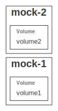

# Mock multi provider

This is a playground for testing multiple dependant providers

### Installation:

In the _examples/mock-multi_ directory:

```
npm i
```

### Npm link

To use the local version of _grucloud_, use the _npm link_ command:

```
npm link @grucloud/core
```

Now go to the root of the project:

```
cd ../../
npm link
```

### Mock Cloud Service Povider

Open a new terminal and go to the root directory:

```
npm run start:mock
```

## Commands

List the live resources:

```
gc list
```

List the resources that will be deployed:

```
gc plan
```

Deploy the resources:

```
gc apply
```

Destroy the resources:

```
gc destroy
```

## Dependency Graph

```sh
gc graph
```


