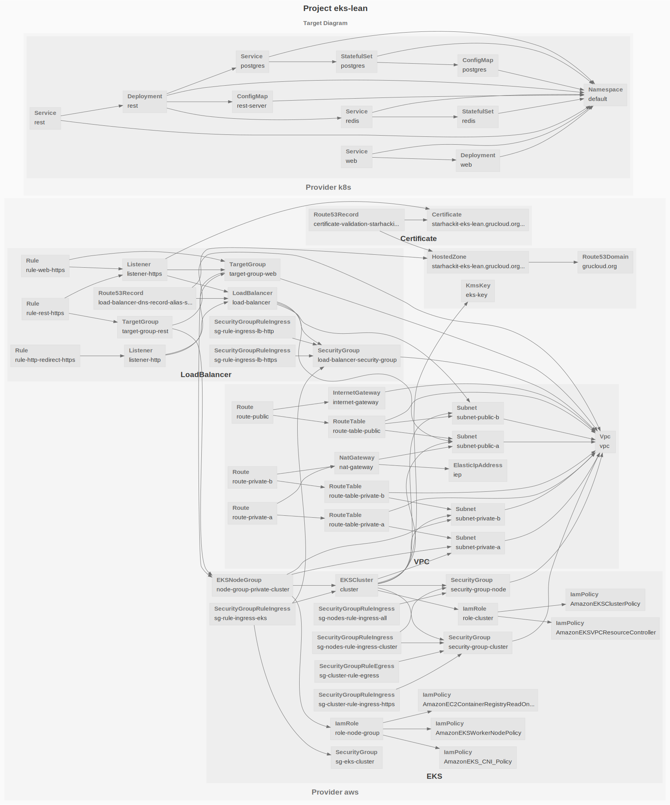
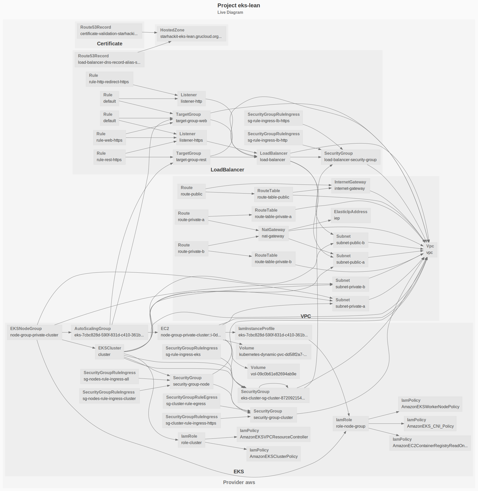

# Full Stack Application on AWS EKS, Load Balancer by GrouCloud.

This example deploys a full-stack application with Kubernetes on AWS using their managed control plane called [Elastic Kubernetes Service](https://aws.amazon.com/eks/)

In this flavour, the load balancer, target groups, listeners and rules are managed by GruCloud instead of the [AWS Load Balancer Controller](https://docs.aws.amazon.com/eks/latest/userguide/aws-load-balancer-controller.html).
The benefit of not using the LBC is to free a lot of resources, the LBC depends on the [Cert Manager](https://cert-manager.io/) which brings more resources,
By not using the AWS LBC and the Cert Manager, we can save 4 pods, and numerous other resources such as ServiceAcount, ClusterRole, ClusterRoleBinding, we can even get rid of the CRD stuff.
Less pods means we can choose a cheaper worker node.

This infrastructure combines 2 providers: AWS and Kubernetes.



## Modules

A few modules for each of these providers are being used.

### Modules for AWS resources

- [module-aws-certificate](https://www.npmjs.com/package/@grucloud/module-aws-certificate)
- [module-aws-vpc](https://www.npmjs.com/package/@grucloud/module-aws-vpc)
- [module-aws-eks](https://www.npmjs.com/package/@grucloud/module-aws-eks)
- [module-aws-load-balancer](https://www.npmjs.com/package/@grucloud/module-aws-load-balancer)

### Modules for K8s resources

The local module defining the app on the k8s side is located at [base](../base)

## Configuration

### Amazon EKS

The first part of this deployment is to create an EKS control plan, a node group for the workers and all their numerous dependencies.

Configuration for the AWS resources is located at [configAws.js](./configAws.js)

Set the **rootDomainName** and **domainName** according to your use case

> For end to end automation, the **rootDomainName** should be registered or transfered to the AWS Route53 service.

### K8s

The second part is the kubernetes deployment of the full-stack application composed of a react front end, a node backend, postgres as the SQL database and finally redis for the cache and published/subscriber models.

Configuration for the K8s resources is located at [configK8s.js](./configK8s.js)

## Requirements

- Ensure access to the [AWS Console](https://console.aws.amazon.com)
- AWS CLI

Verify the AWS CLI is installed:

```
aws --version
```

- AWS Access and Secret Key

```sh
aws configure
```

- Node.js 14

Check _node_ is present on your machine:

```
node --version
```

- GruCloud CLI

Install the GruCloud CLI with:

```
npm install -g grucloud/core
```

Verify **gc** is installed correctly:

```sh
gc --version
```

## Workflow

### Listing

Let's find out if everyting is setup properly by listing the live resources from AWS:

```sh
gc list
```

```txt
Listing resources on 2 providers: aws, k8s
✓ aws
  ✓ Initialising
  ✓ Listing 29/29
k8s
  Initialising
  Listing 0/8
List Summary:
Provider: aws
┌───────────────────────────────────────────────────────────────────────────────────────────────┐
│ aws                                                                                           │
├────────────────────┬──────────────────────────────────────────────────────────────────────────┤
│ IamPolicy          │ AmazonEKSClusterPolicy                                                   │
│                    │ AmazonEKSVPCResourceController                                           │
│                    │ AmazonEKSWorkerNodePolicy                                                │
│                    │ AmazonEC2ContainerRegistryReadOnly                                       │
│                    │ AmazonEKS_CNI_Policy                                                     │
├────────────────────┼──────────────────────────────────────────────────────────────────────────┤
│ Route53Domain      │ grucloud.org                                                             │
├────────────────────┼──────────────────────────────────────────────────────────────────────────┤
│ Vpc                │ default                                                                  │
├────────────────────┼──────────────────────────────────────────────────────────────────────────┤
│ InternetGateway    │ igw-9c2f1ae7                                                             │
├────────────────────┼──────────────────────────────────────────────────────────────────────────┤
│ SecurityGroup      │ default                                                                  │
├────────────────────┼──────────────────────────────────────────────────────────────────────────┤
│ Subnet             │ default                                                                  │
│                    │ default                                                                  │
│                    │ default                                                                  │
│                    │ default                                                                  │
│                    │ default                                                                  │
│                    │ default                                                                  │
├────────────────────┼──────────────────────────────────────────────────────────────────────────┤
│ RouteTable         │ rtb-19753867                                                             │
└────────────────────┴──────────────────────────────────────────────────────────────────────────┘
19 resources, 8 types, 1 provider
Command "gc l" executed in 5s
```

Note the presence of a default VPC, subnets, security group and internet gateway.

> Verify that the domain name is registered with Route53Domain, in this case _grucloud.org_

The Kubernetes control created by EKS is not up yet, as a consequence, listing the k8s resources cannot be retrieved at this stage.

### Deploying

Show time for deploying all the AWS and Kubernetes resources in one command:

```sh
gc apply
```

The app should be now running with Kubernetes on AWS.

When all the resources are created, custom code can be invoked in [hook.js](./hook.js).
In this example, we verify access to the web server and the API server securely.
This  
Let's list and produce a diagram of the AWS resources freshly created:

```sh
gc list -p aws --graph -a --default-exclude --types-exclude Certificate --types-exclude Route53Domain --types-exclude NetworkInterface
```



Notice that the NodeGroup has created an AutoScaling Group, which in turns creates EC2 instances, intance profiles and volumes.
