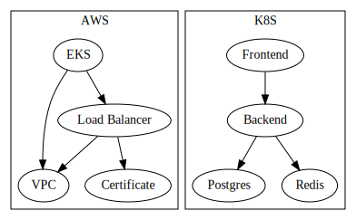

# Full Stack Application on AWS EKS, Load Balancer by GrouCloud.

This example deploys a full-stack application with Kubernetes on AWS using their managed control plane called [Elastic Kubernetes Service](https://aws.amazon.com/eks/)

In this flavour, the load balancer, target groups, listeners and rules are managed by GruCloud instead of the [AWS Load Balancer Controller](https://docs.aws.amazon.com/eks/latest/userguide/aws-load-balancer-controller.html).
The benefit of not using the LBC is to free a lot of resources, the LBC depends on the [Cert Manager](https://cert-manager.io/) which brings more resources,
By not using the AWS LBC and the Cert Manager, we can save 4 pods, and numerous other resources such as ServiceAcount, ClusterRole, ClusterRoleBinding, we can even get rid of the CRD stuff.
Less pods means we can choose a cheaper worker node.

This infrastructure combines 2 providers: AWS and Kubernetes.



## Modules

A few modules for each of these providers are being used.

### Modules for AWS resources

- [module-aws-certificate](https://www.npmjs.com/package/@grucloud/module-aws-certificate)
- [module-aws-vpc](https://www.npmjs.com/package/@grucloud/module-aws-vpc)
- [module-aws-eks](https://www.npmjs.com/package/@grucloud/module-aws-eks)

### Modules for K8s resources

The local module defining the app on the k8s side is located at [base](../base)

## Amazon EKS

The first part of this deployment is to create an EKS control plan, a node group for the workers and all their numerous dependencies.

Configuration for the AWS resources is located at [configAws.js](./configAws.js)

Set the **rootDomainName** and **domainName** according to your use case

> For end to end automation, the **rootDomainName** should be registered or transfered to the AWS Route53 service.

## K8s

The second part is the kubernetes deployment of the full-stack application composed of a react front end, a node backend, postgres as the SQL database and finally redis for the cache and published/subscriber models.

Configuration for the K8s resources is located at [configK8s.js](./configK8s.js)

## Load Balancer

The third part of the deployment begins when k8s services are up. The AWS load balancer target group depends on this services.

## Troubleshooting

```sh
gc l -t LoadBalancer
```
