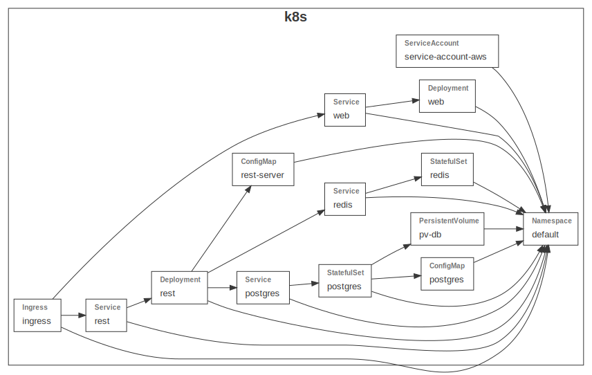

# Deploy Starhackit on minikube with GruCloud

This code deploys [starhackit](https://github.com/FredericHeem/starhackit) on minikube.

## Minikube

Ensure minikube is installed:

```
minikube version
```

Ensure minikube is up and running:

```
minikube start
```

For this project, enable the ingress addon:

```
minikube addons enable ingress
```

Do not forget to glance at the kubernetes dashboard:

```
minikube dashboard
```

## GruCloud

Grucloud can define and manage kubernetes infrastructure with simple Javascript code instead of the traditional YAML file.

In this case, the file [iac.js](./iac.js) import the [base kubernetes resources](../base/k8sStackBase.js) for our application and add the ingress controller specific to minikube.

### Requirement

- Ensure node is installed: `node --version`
- Install the Grucloud CLI **gc** globally: `npm install @grucloud/core`
- Install the dependencies for this project: `npm install`

## Commands

The following commands will used during this workflow:

- **gc graph**
- **gc apply**
- **gc list**
- **gc output**
- **gc destroy**

### Graph

A picture is worth a thousand word, the _graph_ command creates a graph of the resources according to their dependencies:

```
gc graph
```



### Apply Commands:

```sh
gc apply
```

```sh
Querying resources on 1 provider: k8s
✓ k8s
  ✓ Initialising
  ✓ Listing 14/14
  ✓ Querying
    ✓ Namespace 1/1
    ✓ ConfigMap 2/2
    ✓ PersistentVolume 1/1
    ✓ StatefulSet 2/2
    ✓ Service 4/4
    ✓ Deployment 2/2
    ✓ ServiceAccount 1/1
    ✓ Ingress 1/1

┌──────────────────────────────────────────────────────────────────────────────────────────────────┐
│ Plan summary for provider k8s │
├──────────────────────────────────────────────────────────────────────────────────────────────────┤
│ DEPLOY RESOURCES │
├────────────────────┬─────────────────────────────────────────────────────────────────────────────┤
│ ConfigMap │ default::postgres, default::rest-server │
├────────────────────┼─────────────────────────────────────────────────────────────────────────────┤
│ PersistentVolume │ pv-db │
├────────────────────┼─────────────────────────────────────────────────────────────────────────────┤
│ StatefulSet │ default::postgres, default::redis │
├────────────────────┼─────────────────────────────────────────────────────────────────────────────┤
│ Service │ default::postgres, default::redis, default::rest, default::web │
├────────────────────┼─────────────────────────────────────────────────────────────────────────────┤
│ Deployment │ default::rest, default::web │
├────────────────────┼─────────────────────────────────────────────────────────────────────────────┤
│ ServiceAccount │ default::service-account-aws │
├────────────────────┼─────────────────────────────────────────────────────────────────────────────┤
│ Ingress │ default::ingress │
└────────────────────┴─────────────────────────────────────────────────────────────────────────────┘
? Are you sure to deploy 13 resources, 7 types on 1 provider? › (y/N)

```

Review the change and type 'y' to deploy the infrastructure:

```sh
Deploying resources on 1 provider: k8s
✓ k8s
  ✓ Initialising
  ✓ Deploying
    ✓ ConfigMap 2/2
    ✓ PersistentVolume 1/1
    ✓ StatefulSet 2/2
    ✓ Service 4/4
    ✓ Deployment 2/2
    ✓ ServiceAccount 1/1
    ✓ Ingress 1/1
  ✓ default::onDeployed
    ✓ Check webserver with http
13 resources deployed of 7 types and 1 provider
Command "gc apply" executed in 49s
```

### List Command

To list our freshly installed resources:

```sh
gc list --our
```

```
List Summary:
Provider: k8s
┌──────────────────────────────────────────────────────────────────────────────────────────────────┐
│ k8s                                                                                              │
├────────────────────┬─────────────────────────────────────────────────────────────────────────────┤
│ Ingress            │ default::ingress                                                            │
├────────────────────┼─────────────────────────────────────────────────────────────────────────────┤
│ ServiceAccount     │ default::service-account-aws                                                │
├────────────────────┼─────────────────────────────────────────────────────────────────────────────┤
│ Service            │ default::postgres                                                           │
│                    │ default::redis                                                              │
│                    │ default::rest                                                               │
│                    │ default::web                                                                │
├────────────────────┼─────────────────────────────────────────────────────────────────────────────┤
│ Deployment         │ default::rest                                                               │
│                    │ default::web                                                                │
├────────────────────┼─────────────────────────────────────────────────────────────────────────────┤
│ ReplicaSet         │ default::rest-554d59b586                                                    │
│                    │ default::web-5d88774776                                                     │
├────────────────────┼─────────────────────────────────────────────────────────────────────────────┤
│ ConfigMap          │ default::postgres                                                           │
│                    │ default::rest-server                                                        │
├────────────────────┼─────────────────────────────────────────────────────────────────────────────┤
│ StatefulSet        │ default::postgres                                                           │
│                    │ default::redis                                                              │
├────────────────────┼─────────────────────────────────────────────────────────────────────────────┤
│ PersistentVolume   │ pv-db                                                                       │
├────────────────────┼─────────────────────────────────────────────────────────────────────────────┤
│ PersistentVolumeC… │ default::pv-db-postgres-0                                                   │
├────────────────────┼─────────────────────────────────────────────────────────────────────────────┤
│ Pod                │ default::postgres-0                                                         │
│                    │ default::redis-0                                                            │
│                    │ default::rest-554d59b586-mqszs                                              │
│                    │ default::web-5d88774776-btqp4                                               │
└────────────────────┴─────────────────────────────────────────────────────────────────────────────┘
20 resources, 10 types, 1 provider
Command "gc list --our" executed in 2s
```

To filter the list by a specific type such as Ingress:

```
gc list --types Ingress
```

```
Listing resources on 1 provider: k8s
✓ k8s
  ✓ Initialising
  ✓ Listing 1/1
┌───────────────────────────────────────────────────────────────────────────────────────────────────┐
│ 1 Ingress from k8s                                                                                │
├──────────────────┬─────────────────────────────────────────────────────────────────────────┬──────┤
│ Name             │ Data                                                                    │ Our  │
├──────────────────┼─────────────────────────────────────────────────────────────────────────┼──────┤
│ default::ingress │ metadata:                                                               │ Yes  │
│                  │   name: ingress                                                         │      │
│                  │   namespace: default                                                    │      │
│                  │   uid: 1aa09976-ad83-4588-adea-9876af110bd2                             │      │
│                  │   resourceVersion: 7157                                                 │      │
│                  │   generation: 1                                                         │      │
│                  │   creationTimestamp: 2021-03-09T03:48:36Z                               │      │
│                  │   annotations:                                                          │      │
│                  │     CreatedByProvider: k8s                                              │      │
│                  │     ManagedBy: GruCloud                                                 │      │
│                  │     Name: ingress                                                       │      │
│                  │     nginx.ingress.kubernetes.io/use-regex: true                         │      │
│                  │     projectName: grucloud-k8s-minikube-starhackit                       │      │
│                  │     stage: dev                                                          │      │
│                  │ spec:                                                                   │      │
│                  │   rules:                                                                │      │
│                  │     - http:                                                             │      │
│                  │         paths:                                                          │      │
│                  │           - path: /api/.*                                               │      │
│                  │             pathType: Prefix                                            │      │
│                  │             backend:                                                    │      │
│                  │               service:                                                  │      │
│                  │                 name: rest                                              │      │
│                  │                 port:                                                   │      │
│                  │                   number: 9000                                          │      │
│                  │     - http:                                                             │      │
│                  │         paths:                                                          │      │
│                  │           - path: /.*                                                   │      │
│                  │             pathType: Prefix                                            │      │
│                  │             backend:                                                    │      │
│                  │               service:                                                  │      │
│                  │                 name: web                                               │      │
│                  │                 port:                                                   │      │
│                  │                   number: 80                                            │      │
│                  │ status:                                                                 │      │
│                  │   loadBalancer:                                                         │      │
│                  │     ingress:                                                            │      │
│                  │       - ip: 192.168.64.5                                                │      │
│                  │                                                                         │      │
└──────────────────┴─────────────────────────────────────────────────────────────────────────┴──────┘


List Summary:
Provider: k8s
┌──────────────────────────────────────────────────────────────────────────────────────────────────┐
│ k8s                                                                                              │
├────────────────────┬─────────────────────────────────────────────────────────────────────────────┤
│ Ingress            │ default::ingress                                                            │
└────────────────────┴─────────────────────────────────────────────────────────────────────────────┘
1 resource, 1 type, 1 provider
Command "gc list --types Ingress" executed in 1s
```

### Output Command

Notice the ip address of the load balancer at the field `status.loadBalancer.ingress.ip`

One can retrieve this ip address with the **output** command given the name, the type and the field to extract:

```
gc output  --name default::ingress --type Ingress --field "status.loadBalancer.ingress[0].ip"
```

To check the application is up and running, open a browser at the following address or use the macosx _open_ command:

```
open http://`gc output  --name default::ingress --type Ingress --field "status.loadBalancer.ingress[0].ip"`

```

### Destroy

The _destroy_ command instructs the k8s control plane to destroy all the resources:

```sh
gc destroy
```

```sh
Find Deletable resources on 1 provider: k8s
✓ k8s
  ✓ Initialising
  ✓ Listing 12/12
┌───────────────────────────────────────────────────────────────────────────────────────────┐
│ Destroy summary for provider k8s                                                          │
├────────────────────┬──────────────────────────────────────────────────────────────────────┤
│ ConfigMap          │ default::postgres, default::rest-server                              │
├────────────────────┼──────────────────────────────────────────────────────────────────────┤
│ Deployment         │ default::rest, default::web                                          │
├────────────────────┼──────────────────────────────────────────────────────────────────────┤
│ StatefulSet        │ default::postgres, default::redis                                    │
├────────────────────┼──────────────────────────────────────────────────────────────────────┤
│ ServiceAccount     │ default::service-account-aws                                         │
├────────────────────┼──────────────────────────────────────────────────────────────────────┤
│ PersistentVolume   │ pv-db                                                                │
├────────────────────┼──────────────────────────────────────────────────────────────────────┤
│ Service            │ default::postgres, default::redis, default::rest, default::web       │
├────────────────────┼──────────────────────────────────────────────────────────────────────┤
│ Ingress            │ default::ingress                                                     │
├────────────────────┼──────────────────────────────────────────────────────────────────────┤
│ PersistentVolumeC… │ default::pv-db-postgres-0                                            │
└────────────────────┴──────────────────────────────────────────────────────────────────────┘
? Are you sure to destroy 14 resources, 8 types on 1 provider? › (y/N)

```

```
Destroying resources on 1 provider: k8s
✓ k8s
  ✓ Initialising
  ✓ Destroying
    ✓ ConfigMap 2/2
    ✓ Deployment 2/2
    ✓ StatefulSet 2/2
    ✓ ServiceAccount 1/1
    ✓ PersistentVolume 1/1
    ✓ Service 4/4
    ✓ Ingress 1/1
    ✓ PersistentVolumeClaim 1/1
  ✓ default::onDestroyed
14 resources destroyed, 8 types on 1 provider
Command "gc d" executed in 2m 9s
```

To check all our resources have been destroyed, run the list command:

```sh
gc l -o
```

```
Listing resources on 1 provider: k8s
✓ k8s
  ✓ Initialising
  ✓ Listing 14/14
List Summary:
Provider: k8s
┌───────────────────────────────────────────────────────────────────────────────────────────┐
│ k8s                                                                                       │
└───────────────────────────────────────────────────────────────────────────────────────────┘
0 resources, 0 types, 1 provider
Command "gc l -o" executed in 1s
```
