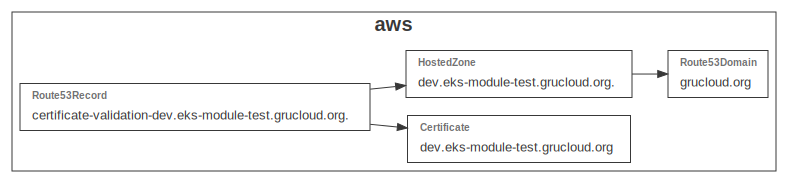

# GruCloud Module for Aws SSL Certificate validated with DNS

The purpose of this module is to deploy an AWS SSL certificate and verify it with DNS.

When an AWS Certificate is created, the api returns information about a dns record to be added. At this point, a _Route53Record_ resource is created with this info.

> Your domain name need to be registered with AWS Route53 Service.

## Resources

This module exports the **createResources** function that takes an AWS provider and returns the following resources:

- [Certificate](https://www.grucloud.com/docs/aws/resources/ACM/AcmCertificate)
- [Route53Domain](https://www.grucloud.com/docs/aws/resources/Route53Domain/Route53Domain)
- [HostedZone](https://www.grucloud.com/docs/aws/resources/Route53/Route53HostedZone)
- [Route53Record](https://www.grucloud.com/docs/aws/resources/Route53/Route53Record)

## Dependency Graph

```sh
gc graph
```



# How to use this module

The following guide explains how to consume this module by creating a simple example.

- Create a new project with _npm init_
- Install the dependencies with _npm install_
- Create 2 files **config.js** and **iac.js**
- Run the **gc** commands: **apply**, **list** and **destroy**

### Create a test project

```
mkdir test-aws-certificate
cd test-aws-certificate
npm init
```

### Install this module

```sh
npm i @grucloud/core @grucloud/provider-aws @grucloud/module-aws-certificate
```

### Configuration

Create the **config.js** and set the **certificate** section according to your setup:

```js
// config.js
const pkg = require("./package.json");
module.exports = ({ stage }) => ({
  certificate: {
    rootDomainName: "yourdomain.org",
    domainName: "anysubdomain.yourdomain.org",
  },
  projectName: pkg.name,
});
```

### IAC

The _@grucloud/module-aws-certificate_ module is imported with the NodeJs **require** and exposes the **config** and **createResources** functions:

```js
// iac.js
const { AwsProvider } = require("@grucloud/provider-aws");
const ModuleAwsCertificate = require("@grucloud/module-aws-certificate");

exports.createStack = async ({ config }) => {
  const provider = AwsProvider({
    configs: [config, ModuleAwsCertificate.config],
  });

  const certificateResources = await ModuleAwsCertificate.createResources({
    provider,
  });

  return {
    provider,
    resources: { certificateResources },
  };
};
```

## Using the **cli**

At this step, you have a new project set up, configured with **config.js**, and the infrastructure described in **iac.js**

To deploy the certificate and the route53 resources, use the **apply** command:

```
gc apply
```

Let's check that the certificate is in the **ISSUED** _Status_

```sh
gc l -t Certificate -o
```

Do not forget to destroy the resources when no longer needed:

```sh
gc destroy
```

> By default, one AWS account can destroy a maximum of 20 certificates per year, for this reason, by default, certificates are not destroyed by GruCloud. You still can delete them with the AWS CLI or web interface.
