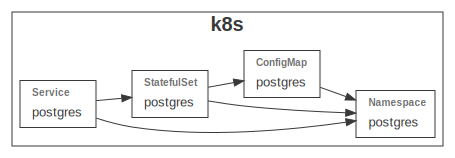

# Kubernetes Redis module

This module defines the kubernetes resources required to run Redis.

## Config

The [config.js](./config.js) file gathers the configuration for this module.

## Resources

This module exports 2 kubernetes resources through the _createResources_ function from the [iac.js](./iac.js) file.

#### StatefulSet

Define the redis stateful set:

- image name, version and port
- **readinessProbe** and **livenessProbe** using the _psql_ command to find out if the database is up and running

#### Service

A headless service forwards traffic to the postgres database. The idea behind using a headless service is to get a unique dns entry that can be referenced by the backend and other (micro)services.

## Usage

This module is being used in the following projects:

- [this example](./example/README.md)
- [starhackit](https://github.com/grucloud/grucloud/tree/main/examples/k8s/starhackit/base)
