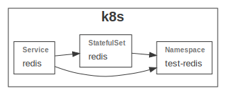

# GrucCloud Kubernetes Redis Example

This example demonstrate how to use the GruCloud Kubernetes Redis module.



## Config

Edit [config.js](./config.js) to configure this example.

## Requirements

- minikube
- The GruCloud Cli: **gc**

## Install

```sh
npm install
```

## Playground

Deploy the resources with:

```sh
gc apply
```

## Testing

Run the tests with **mocha**:

```sh
npm test
```
