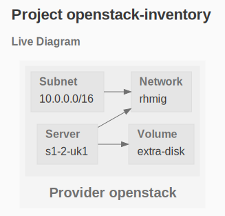
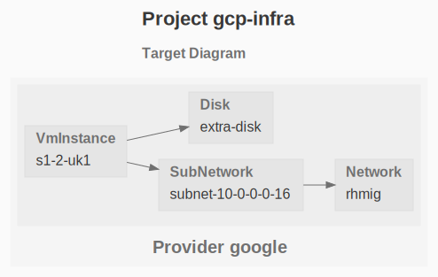
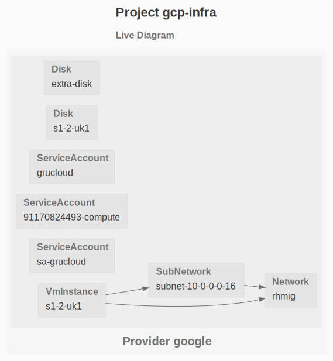

# OpenStack2Gcp

This project automatically migrates an [OpenStack](https://www.openstack.org/) infrastructure to the [Google Cloud Platform](https://cloud.google.com/)

Numerous cloud providers implement the [OpenStack API](https://docs.openstack.org/api-quick-start/) such as RedHat, OVH, IBM, HP etc ... Find out the list of [public clouds](https://www.openstack.org/marketplace/public-clouds/) and [private clouds](https://www.openstack.org/marketplace/hosted-private-clouds/).

The migration is a 3 step process:

- Step 1: Retrieve the live inventory of the OpenStack infrastructure: networks, subnetworks, virtual machines and disks.
- Step 2: Transform the OpenStack inventory into a GCP GruCloud code.
- Step 3: Use the GruCloud CLI to deploy the infrastructure from the generated code.

Since the infrastructure is now described as code, updating and destroying the infra can be performed with GruCloud CLI.

## Step 1: OpenStack Inventory

Instructions are provided in the [openstack-inventory README](openstack-inventory/README)

At the end of this process, the live infra is described in a file such as [gc-list.json](openstack-inventory/iac.js)



## Step 2: Transform OpenStack Inventory into GrucCloud GCP code

The step tranforms the OpenStack inventory [gc-list.json](openstack-inventory/iac.js) into [iac.js](gcp-infra/iac.js): the GruCloud code describing the GCP infra that will be used later on by the GruCloud CLI.

```sh
npm run generate
```

> The file [mapping.json](./mappings) defines the mappings between machine type and image OS between the 2 clouds.

## Step 3: Deploy the GCP infa

In addition to the generated file [iac.js], the directory _gcp-infra_ contains the other files required to deploy the infra.

For a detailed guide on how to prepare the deployment, see [Google Getting Started](https://www.grucloud.com/docs/google/GoogleGettingStarted)

TL;DR

The following commands are used to managed the infrastrucure:

- gc graph
- gc apply
- gc list
- gc destroy

### Target Diagram

The graph command generates a graph of the target resources based only on the code:

```sh
gc graph
```



### Deploying

The _apply_ command will deploy the infrastructure:

```
gc apply
```

```sh
Querying resources on 1 provider: google
✓ google
  ✓ Initialising
  ✓ Listing 7/7
  ✓ Querying
    ✓ Network 1/1
    ✓ SubNetwork 1/1
    ✓ Disk 1/1
    ✓ VmInstance 1/1

┌────────────────────────────────────────────────────────────────────────────┐
│ Plan summary for provider google                                           │
├────────────────────────────────────────────────────────────────────────────┤
│ DEPLOY RESOURCES                                                           │
├────────────────────┬───────────────────────────────────────────────────────┤
│ Network            │ rhmig                                                 │
├────────────────────┼───────────────────────────────────────────────────────┤
│ SubNetwork         │ subnet-10-0-0-0-16                                    │
├────────────────────┼───────────────────────────────────────────────────────┤
│ Disk               │ extra-disk                                            │
├────────────────────┼───────────────────────────────────────────────────────┤
│ VmInstance         │ s1-2-uk1                                              │
└────────────────────┴───────────────────────────────────────────────────────┘
? Are you sure to deploy 4 resources, 4 types on 1 provider? › (y/N)
Deploying resources on 1 provider: google
✓ google
  ✓ Initialising
  ✓ Deploying
    ✓ Network 1/1
    ✓ SubNetwork 1/1
    ✓ Disk 1/1
    ✓ VmInstance 1/1
4 resources deployed of 4 types and 1 provider
Running OnDeployedGlobal resources on 1 provider: google
Command "gc a" executed in 1m 18s
```

### Listing

Retrieve the live resources as well as generate a graph:

```
gc list --graph
```

```
List Summary:
Provider: google
┌────────────────────────────────────────────────────────────────────────────┐
│ google                                                                     │
├────────────────────┬───────────────────────────────────────────────────────┤
│ Disk               │ extra-disk                                            │
│                    │ s1-2-uk1                                              │
├────────────────────┼───────────────────────────────────────────────────────┤
│ Network            │ default                                               │
│                    │ rhmig                                                 │
├────────────────────┼───────────────────────────────────────────────────────┤
│ SubNetwork         │ default                                               │
│                    │ subnet-10-0-0-0-16                                    │
├────────────────────┼───────────────────────────────────────────────────────┤
│ ServiceAccount     │ grucloud                                              │
│                    │ 91170824493-compute                                   │
│                    │ sa-grucloud                                           │
├────────────────────┼───────────────────────────────────────────────────────┤
│ VmInstance         │ s1-2-uk1                                              │
└────────────────────┴───────────────────────────────────────────────────────┘
10 resources, 5 types, 1 provider

```



### Destroy

Destroying the infra is just a command away:

```sh
gc destroy
```

```txt
Find Deletable resources on 1 provider: google
✓ google
  ✓ Initialising
  ✓ Listing 7/7

┌────────────────────────────────────────────────────────────────────────────┐
│ Destroy summary for provider google                                        │
├────────────────────┬───────────────────────────────────────────────────────┤
│ Disk               │ extra-disk                                            │
├────────────────────┼───────────────────────────────────────────────────────┤
│ Network            │ rhmig                                                 │
├────────────────────┼───────────────────────────────────────────────────────┤
│ SubNetwork         │ subnet-10-0-0-0-16                                    │
├────────────────────┼───────────────────────────────────────────────────────┤
│ VmInstance         │ s1-2-uk1                                              │
└────────────────────┴───────────────────────────────────────────────────────┘
✔ Are you sure to destroy 4 resources, 4 types on 1 provider? … yes
Destroying resources on 1 provider: google
✓ google
  ✓ Initialising
  ✓ Destroying
    ✓ Disk 1/1
    ✓ Network 1/1
    ✓ SubNetwork 1/1
    ✓ VmInstance 1/1
4 resources destroyed, 4 types on 1 provider
Running OnDestroyedGlobal resources on 1 provider: google
Command "gc destroy" executed in 1m 20s
```
