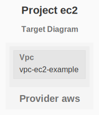
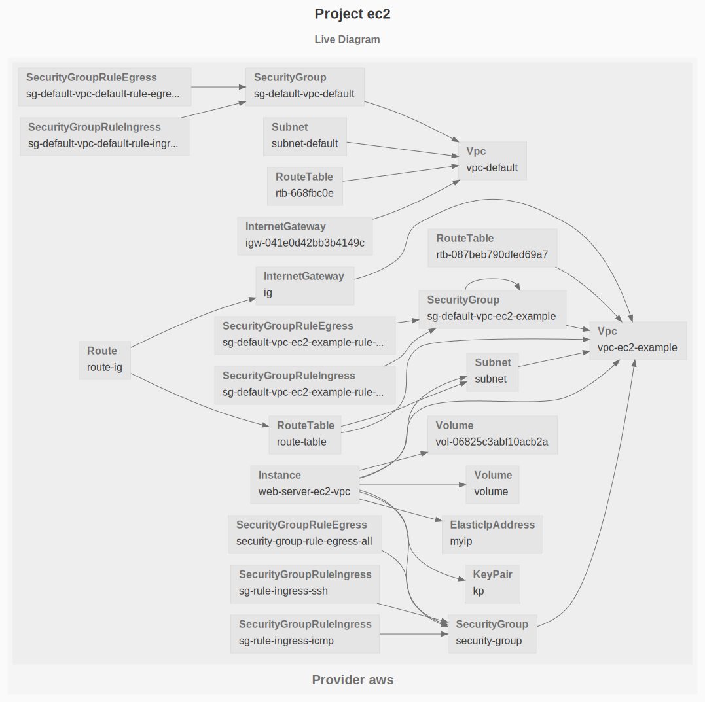

# EC2

The purpose of this example is to deploy an EC2 instance attached to an elastic public IP address.

See the [AWS Getting Started](https://www.grucloud.com/docs/aws/AwsGettingStarted)

## Dependency Graph

```sh
gc graph
```



## Live diagram

```sh
gc list --graph --types-exclude KeyPair
```


